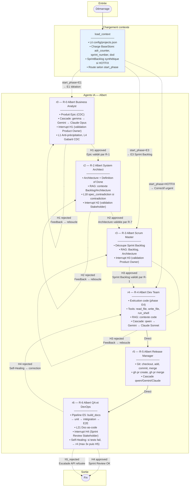

# Graphe Agile — Vue enrichie (nœuds et arêtes)

Diagramme Mermaid avec le contenu détaillé des nœuds et des conditions des arêtes.

## Légende

| Code | Signification |
|------|---------------|
| **R-0** | Albert Business Analyst |
| **R-2** | Albert System Architect |
| **R-3** | Albert Scrum Master |
| **R-4** | Albert Dev Team |
| **R-5** | Albert Release Manager |
| **R-6** | Albert QA & DevOps |
| **R-1** | Nghia Product Owner (humain) |
| **R-7** | Nghia Stakeholder (humain) |
| **H1** | Validation Epic |
| **H2** | Validation Architecture + DoD |
| **H3** | Validation Sprint Backlog |
| **H4** | Sprint Review |
| **H5** | Approbation escalade API payante |

## Arêtes

- **Plein (→)** : arête directe, pas de condition
- **Pointillé (-.->)** : arête conditionnelle (routing selon l'état)
