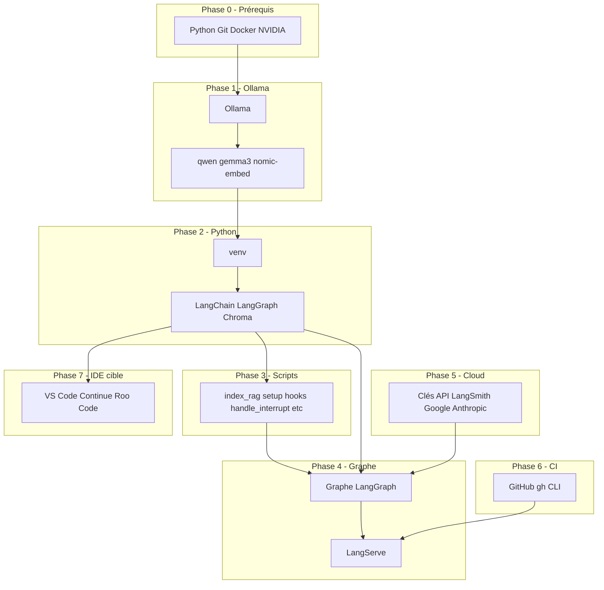

# Plan d'Implémentation — Écosystème Agile Agent IA sur Calypso

## Conventions

**Nomenclature 4D** : Toute action humaine est préfixée par `[ SOURCE > APP > VUE ] -> (CIBLE)`.


| Composant | Valeurs dans ce plan                            |
| --------- | ----------------------------------------------- |
| SOURCE    | `PC` (machine où tu tapes, Laptop Windows)      |
| APP       | `Cursor`, `Navigateur Web`, `PowerShell`        |
| VUE       | `Terminal`, `Chat`, `Éditeur`, `Explorateur`    |
| CIBLE     | `Calypso` (Linux RTX 3060), `Cloud` (sites web) |


**Règle d'exécution** : Tu es connecté à Calypso via Remote SSH depuis Cursor. Les commandes dans le Terminal Cursor s'exécutent sur Calypso sauf indication contraire.

**Bootstrap vs Cible** :

- **Bootstrap** : Pendant toute l'implémentation (Phases 0 à 8), tu restes dans **Cursor**. C'est l'outil qui exécute les commandes, édite les fichiers et pilote l'installation.
- **Cible** : L'IDE de l'écosystème (spec III.3, II) est **VS Code + Continue.dev + Roo Code**. Il est installé en Phase 7, une fois Ollama, LangGraph, scripts et comptes cloud opérationnels. Tu bascules vers cet IDE pour le travail quotidien (R-1, R-7) : priorisation backlog, validation H1–H4, pair programming. Le flux automatisé (E4, E5) reste piloté par LangGraph, pas par Roo Code.

---

## Phase 0 — Prérequis système (Calypso)

Objectif : Vérifier que Calypso possède tout le nécessaire avant d'installer l'écosystème. Aucune dépendance circulaire.

### 0.1 Connexion SSH et identité Calypso

- [ PC > Cursor > Explorateur ] Ouvrir Cursor, menu **File > Connect to Host**, sélectionner ou ajouter `nghia-phan@calypso` (ou l'hôte configuré dans `~/.ssh/config`).
- [ PC > Cursor > Terminal ] Une fois connecté, le terminal affiche un prompt du type `user@calypso:~$`. Vérifier que tu es bien sur Calypso :

```
hostname && uname -a
```

- Résultat attendu : hostname contenant "calypso" (ou le nom de ta machine), Linux.

### 0.2 Vérifier Python 3.10+ et pip

- [ PC > Cursor > Terminal ] -> (Calypso)

```
python3 --version
pip3 --version
```

- Si Python < 3.10 : installer via `sudo apt update && sudo apt install -y python3.12 python3.12-venv python3-pip` (ou équivalent selon ta distro).

### 0.3 Vérifier Git

- [ PC > Cursor > Terminal ] -> (Calypso)

```
git --version
```

- Si absent : `sudo apt install -y git`

### 0.4 Vérifier Docker

- [ PC > Cursor > Terminal ] -> (Calypso)

```
docker --version
docker run hello-world
```

- Si absent : `sudo apt install -y docker.io` puis `sudo usermod -aG docker $USER` ; se déconnecter/reconnecter pour que le groupe soit pris en compte.

### 0.5 Vérifier NVIDIA + pilote + VRAM

- [ PC > Cursor > Terminal ] -> (Calypso)

```
nvidia-smi
```

- Vérifier : "NVIDIA GeForce RTX 3060", "12288MiB" (12 Go). Si pilote manquant, installer les drivers NVIDIA appropriés (hors scope détaillé ici).

---

## Phase 1 — Ollama et modèles (Calypso)

Ollama est la base : LangGraph, index_rag et Cursor (via MCP optionnel) en dépendent. Aucune autre dépendance en amont.

### 1.1 Installer Ollama

- [ PC > Cursor > Terminal ] -> (Calypso)

```
curl -fsSL https://ollama.com/install.sh | sh
```

- Attendre la fin. Vérifier : `ollama --version`

### 1.2 Démarrer Ollama en arrière-plan

- [ PC > Cursor > Terminal ] -> (Calypso)

```
ollama serve &
```

- Ou, si Ollama est installé comme service : `sudo systemctl start ollama` (selon méthode d'install).
- Vérifier : `curl http://localhost:11434/api/tags` — doit retourner du JSON (même vide).

### 1.3 Télécharger les modèles (ordre recommandé)

Chaque `ollama pull` peut prendre plusieurs minutes. Un seul modèle à la fois en VRAM sur RTX 3060.

- [ PC > Cursor > Terminal ] -> (Calypso)

```
ollama pull qwen2.5-coder:7b
```

- Puis :

```
ollama pull gemma3:12b-it-q4_K_M
```

- Puis :

```
ollama pull nomic-embed-text
```

- Vérifier : `ollama list` — les trois modèles apparaissent.

### 1.4 Configurer OLLAMA_KEEP_ALIVE (RTX 3060)

- [ PC > Cursor > Terminal ] -> (Calypso) Créer ou éditer `~/.bashrc` (ou `~/.profile`) :

```
echo 'export OLLAMA_KEEP_ALIVE=qwen2.5-coder:7b' >> ~/.bashrc
source ~/.bashrc
```

- Cette variable évite le déchargement du modèle pendant E4/E5. Pour Phase 0 / E2, tu peux optionnellement passer à `gemma3:12b-it-q4_K_M` avant de lancer ces phases.

---

## Phase 2 — Projet orchestration Python (Calypso)

Le dépôt `albert-agile` sert de projet orchestration. On crée l'environnement Python et les dépendances.

### 2.1 Aller dans le projet et créer un venv propre

- [ PC > Cursor > Terminal ] -> (Calypso)

```
cd /home/nghia-phan/PROJECTS_WITH_ALBERT/albert-agile
```

- Si un ancien `.venv` existe et contient des packages non conformes à la spec (ex. langchain_huggingface), le supprimer et recréer :

```
rm -rf .venv
python3 -m venv .venv
source .venv/bin/activate
```

### 2.2 Installer les packages Python (spec III.5, checklist 4.1)

- [ PC > Cursor > Terminal ] -> (Calypso) Avec le venv activé (`(.venv)` visible dans le prompt) :

```
pip install --upgrade pip
pip install langgraph langchain langchain-ollama langchain-anthropic langchain-google-genai langchain-chroma pydantic chromadb fastapi uvicorn
```

- Ces packages couvrent : LangGraph, LangChain, connecteurs Ollama/Anthropic/Google, Chroma, Pydantic, LangServe (FastAPI).

### 2.3 Créer la structure des répertoires

- [ PC > Cursor > Terminal ] -> (Calypso)

```
mkdir -p scripts config logs chroma_db
```

- `chroma_db` : stockage persistant Chroma. `logs` : rapports index_rag, pending_index, etc.

### 2.4 Créer ou mettre à jour config/projects.json

- [ PC > Cursor > Éditeur ] -> (Calypso) Ouvrir `config/projects.json`. Format attendu (spec III.8-G) :

```json
{
  "albert-agile": {
    "path": "/home/nghia-phan/PROJECTS_WITH_ALBERT/albert-agile",
    "auto_next_sprint": false,
    "archived": false,
    "github_repo": "nghiaphan31/albert-agile"
  }
}
```

- Ajouter d'autres projets plus tard en dupliquant ce bloc avec un autre `path` et `github_repo`.

### 2.5 Définir la variable AGILE_ORCHESTRATION_ROOT

- [ PC > Cursor > Terminal ] -> (Calypso)

```
echo 'export AGILE_ORCHESTRATION_ROOT=/home/nghia-phan/PROJECTS_WITH_ALBERT/albert-agile' >> ~/.bashrc
echo 'export AGILE_PROJECTS_JSON=$AGILE_ORCHESTRATION_ROOT/config/projects.json' >> ~/.bashrc
source ~/.bashrc
```

---

## Phase 3 — Scripts opérationnels (Calypso)

Les scripts sont créés dans `scripts/`. L'ordre respecte les dépendances : `index_rag.py` existe déjà ; on complète les autres.

### 3.1 Vérifier index_rag.py

- [ PC > Cursor > Éditeur ] -> (Calypso) Ouvrir [scripts/index_rag.py](scripts/index_rag.py). S'assurer qu'il supporte :
  - `--project-root`, `--project-id`, `--sources` (backlog|architecture|code|all)
  - Option `--incremental` si implémentée
  - Logs dans `logs/index_rag_<timestamp>.log`

### 3.2 Créer setup_project_hooks.sh

- [ PC > Cursor > Éditeur ] -> (Calypso) Créer `scripts/setup_project_hooks.sh` avec le contenu suivant (signature spec III.8-C) :

```bash
#!/bin/bash
# Usage: ./setup_project_hooks.sh --orchestration-root <path> --project-root <path> --project-id <id>

ORCH_ROOT=""
PROJECT_ROOT=""
PROJECT_ID=""
while [[ $# -gt 0 ]]; do
  case $1 in
    --orchestration-root) ORCH_ROOT="$2"; shift 2 ;;
    --project-root) PROJECT_ROOT="$2"; shift 2 ;;
    --project-id) PROJECT_ID="$2"; shift 2 ;;
    *) echo "Usage: $0 --orchestration-root <path> --project-root <path> --project-id <id>"; exit 2 ;;
  esac
done

[ -z "$ORCH_ROOT" ] || [ -z "$PROJECT_ROOT" ] || [ -z "$PROJECT_ID" ] && { echo "Missing args"; exit 2; }

echo "$PROJECT_ID" > "$PROJECT_ROOT/.agile-project-id"
cat > "$PROJECT_ROOT/.agile-env" << EOF
AGILE_ORCHESTRATION_ROOT=$ORCH_ROOT
AGILE_PROJECT_ID=$PROJECT_ID
AGILE_DEFER_INDEX=true
AGILE_PROJECTS_JSON=$ORCH_ROOT/config/projects.json
AGILE_RAG_FILE_WATCHER=false
AGILE_RAG_INCREMENTAL=false
AGILE_BASESTORE_STRICT=true
AGILE_INTERRUPT_TIMEOUT_HOURS=48
SYNC_ARTIFACTS_CRON=0 0 * * 0
EOF

cd "$PROJECT_ROOT"
git checkout -b develop main 2>/dev/null || true
git push -u origin develop 2>/dev/null || true
```

- [ PC > Cursor > Terminal ] -> (Calypso) Rendre exécutable :

```
chmod +x scripts/setup_project_hooks.sh
```

### 3.3 Créer handle_interrupt.py

- [ PC > Cursor > Éditeur ] -> (Calypso) Créer `scripts/handle_interrupt.py` (spec III.8-B). Ce script :
  - Accepte `--thread-id <id>` optionnel
  - Si omis : liste les threads en attente (API LangServe ou accès direct au checkpointer), triés par project_id puis H1→H6
  - Affiche le payload `__interrupt`__, demande `approved` | `rejected` | `feedback`
  - Envoie `graph.invoke(Command(resume=...), config)`
  - Exit codes : 0 succès, 1 erreur, 2 usage
- Implémentation minimale : appeler l'API LangServe `POST /runs/{thread_id}/resume` avec le payload. Si LangServe n'est pas encore déployé, le script peut être un stub qui affiche "À implémenter : appeler LangServe quand le graphe tourne".

### 3.4 Créer purge_checkpoints.py

- [ PC > Cursor > Éditeur ] -> (Calypso) Créer `scripts/purge_checkpoints.py` (spec III.8-L) :

```python
#!/usr/bin/env python3
"""Purge des checkpoints > max-age-days. Exclut les threads avec __interrupt__ non résolu."""
import argparse
# ... (implémentation : lire SqliteSaver, supprimer les checkpoints des threads dont last_step > max_age_days, exclure si __interrupt__)
```

- Signature : `--dry-run`, `--max-age-days 90`, `--protect-active-sprints` (défaut true).

### 3.5 Créer export_chroma.py et import_chroma.py

- [ PC > Cursor > Éditeur ] -> (Calypso) Créer `scripts/export_chroma.py` : `--project-id <id> --output <path>.json`
- Créer `scripts/import_chroma.py` : `--project-id <id> --input <path>.json`
- Ces scripts sérialisent/désérialisent la collection Chroma du projet (spec III.8-L, S10).

### 3.6 Créer notify_pending_interrupts.py

- [ PC > Cursor > Éditeur ] -> (Calypso) Créer `scripts/notify_pending_interrupts.py` (spec F5, III.8-B). Logique :
  - Parcourt les threads avec interrupt en attente
  - Si durée > AGILE_INTERRUPT_TIMEOUT_HOURS (48) : écrit dans `logs/pending_interrupts_alert.log`
  - Si AGILE_NOTIFY_CMD défini : exécute cette commande (ex. email, webhook)

### 3.7 Créer status.py

- [ PC > Cursor > Éditeur ] -> (Calypso) Créer `scripts/status.py` (spec III.8-P, F6). Signature : `--project-id <id>`, `--json`. Affiche : project_id, phase_courante, interrupts_en_attente, dernière_indexation_rag, pending_index, alertes.

---

## Phase 4 — Graphe LangGraph (Calypso)

C'est le cœur du système. Ordre : d'abord le graphe minimal avec load_context, puis les nœuds R-0 à R-6, puis LangServe.

### 4.1 Créer le module graphe (structure)

- [ PC > Cursor > Éditeur ] -> (Calypso) Créer `src/` ou `graph/` à la racine du projet. Exemple : `graph/state.py`, `graph/nodes.py`, `graph/graph.py`.

### 4.2 Définir l'état TypedDict (spec III.5bis)

- [ PC > Cursor > Éditeur ] -> (Calypso) Dans `graph/state.py` :

```python
from typing import TypedDict
from pathlib import Path

class State(TypedDict, total=False):
    project_root: Path
    project_id: str
    sprint_number: int
    adr_counter: int
    needs_architecture_review: bool
    dod: dict | None
    # ... Backlog, Architecture, SprintBacklog, messages, etc.
```

### 4.3 Implémenter load_context (spec III.8-A)

- [ PC > Cursor > Éditeur ] -> (Calypso) Nœud `load_context` :
  1. Lit BaseStore : `project/{id}/adr_counter`, `project/{id}/sprint_counter`, `project/{id}/dod/{sprint_number}`
  2. Gère AGILE_BASESTORE_STRICT (spec F10)
  3. Route selon `start_phase` : E1, E3, ou HOTFIX

### 4.4 Implémenter la cascade N0→N1→N2 (spec III.5, F8)

- [ PC > Cursor > Éditeur ] -> (Calypso) Créer `graph/cascade.py` avec `call_with_cascade(llm_n0, llm_n1, llm_n2, prompt, schema)`. Toute exception Ollama (OOM, timeout, ConnectionError) → escalade N1. Log structuré `n0_failure`. Retry HTTP 429 avec backoff (API_429_MAX_RETRIES=3).

### 4.5 Implémenter les nœuds R-0 à R-6

- Chaque nœud est une fonction `def node_r0(state: State) -> dict: ...`. R-4 utilise les tools `read_file`, `write_file` (atomique, spec F9), `run_shell`. R-5 utilise `run_shell` pour Git.

### 4.6 Configurer le checkpointer (SqliteSaver)

- [ PC > Cursor > Éditeur ] -> (Calypso) Chemin par défaut : `$AGILE_ORCHESTRATION_ROOT/checkpoints.sqlite` ou sous-dossier `data/`.

### 4.7 Configurer Chroma et BaseStore

- Chroma : `chroma_db/` (déjà créé). BaseStore : PostgresStore (pgvector) si Postgres dispo, sinon store custom basé sur Chroma ou fichier JSON (mode dégradé).

### 4.8 Exposer via LangServe (FastAPI)

- [ PC > Cursor > Éditeur ] -> (Calypso) Créer `serve.py` ou équivalent qui monte le graphe sur `/invoke`, `/stream`, `/playground`.

### 4.9 Créer run_graph.py

- [ PC > Cursor > Éditeur ] -> (Calypso) Script CLI :

```bash
python run_graph.py --project-id <id> --start-phase E1|E3|HOTFIX --thread-id <id>-phase-0|<id>-sprint-02|...
```

- Pour HOTFIX : `--hotfix-description "..."`

---

## Phase 5 — Comptes Cloud et clés API (Navigateur)

Aucune dépendance circulaire : les clés sont nécessaires au graphe mais le graphe peut être codé avant. Ordre : créer les comptes, puis injecter les clés dans l'environnement.

### 5.1 LangSmith

- [ PC > Navigateur Web ] -> (Cloud) Aller sur [https://smith.langchain.com](https://smith.langchain.com). Créer un compte. Créer une clé API.
- [ PC > Cursor > Terminal ] -> (Calypso) Ajouter dans `~/.bashrc` ou `.env` du projet :

```
export LANGCHAIN_TRACING_V2=true
export LANGCHAIN_API_KEY=<ta_clé>
```

### 5.2 Google AI Studio

- [ PC > Navigateur Web ] -> (Cloud) Aller sur [https://aistudio.google.com](https://aistudio.google.com). Créer une clé API.
- [ PC > Cursor > Terminal ] -> (Calypso) :

```
export GOOGLE_API_KEY=<ta_clé>
```

### 5.3 Anthropic

- [ PC > Navigateur Web ] -> (Cloud) Aller sur [https://console.anthropic.com](https://console.anthropic.com). Créer une clé API.
- [ PC > Cursor > Terminal ] -> (Calypso) :

```
export ANTHROPIC_API_KEY=<ta_clé>
```

### 5.4 GitHub

- [ PC > Navigateur Web ] -> (Cloud) Avoir un compte GitHub. Pour CI/CD, privilégier un dépôt public (Actions illimité).

---

## Phase 6 — GitHub CLI et Docker (Calypso)

### 6.1 Installer gh (GitHub CLI)

- [ PC > Cursor > Terminal ] -> (Calypso)

```
sudo apt install -y gh
gh auth login
```

- Choisir GitHub.com, HTTPS, s'authentifier (browser ou token). Une seule fois.

### 6.2 Vérifier Docker

- Déjà fait en Phase 0. Les tests R-6 utiliseront Docker pour l'isolation.

---

## Phase 7 — Installation de l'IDE cible (VS Code + Continue.dev + Roo Code)

L'IDE cible de l'écosystème (spec III.3, II) est VS Code + Continue.dev + Roo Code. Cette phase s'exécute **une fois** Ollama, LangGraph, les scripts et les comptes cloud en place. Jusque-là, tu continues à utiliser Cursor en bootstrap.

**Contexte** : VS Code tourne sur ton PC (ou sur Calypso si bureau graphique). Il se connecte à Calypso via Remote-SSH. Continue.dev et Roo Code s'exécutent dans le contexte distant (Calypso), donc ils accèdent à Ollama sur `http://localhost:11434` (localhost = Calypso).

### 7.1 Installer VS Code

- [ PC > Navigateur Web ] -> (Cloud) Télécharger VS Code depuis [https://code.visualstudio.com/](https://code.visualstudio.com/) (version stable pour ton OS, ex. Windows).
- [ PC > Explorateur de fichiers ] Installer VS Code (exécuter l'installateur téléchargé).
- [ PC > VS Code > Extensions ] Installer l'extension **Remote - SSH** (Microsoft). Indispensable pour se connecter à Calypso.

### 7.2 Se connecter à Calypso depuis VS Code

- [ PC > VS Code > Terminal ou palette Ctrl+Shift+P ] Ouvrir la palette de commandes, taper `Remote-SSH: Connect to Host`, sélectionner ou ajouter `nghia-phan@calypso` (ou ton hôte SSH).
- VS Code ouvre une nouvelle fenêtre connectée à Calypso. Le Terminal intégré exécute les commandes sur Calypso.

### 7.3 Installer Continue.dev

- [ PC > VS Code > Extensions ] (fenêtre connectée à Calypso) Rechercher et installer **Continue** (continue.dev).
- [ PC > VS Code > Paramètres Continue ] Configurer :
  - **Modèles** : ajouter Ollama, URL `http://localhost:11434`
  - Modèles à utiliser : `qwen2.5-coder:7b`, `gemma3:12b-it-q4_K_M`
  - Option RAG partagé (spec III.7-bis) : si chroma-mcp est installé sur Calypso, configurer dans `.continue/mcpServers/` pour pointer vers le même Chroma que `index_rag`

### 7.4 Installer Roo Code

- [ PC > VS Code > Extensions ] (fenêtre connectée à Calypso) Rechercher et installer **Roo Code**.
- Configurer Ollama de la même manière : `http://localhost:11434`, modèles `qwen2.5-coder:7b` / `gemma3:12b-it-q4_K_M`.

### 7.5 chroma-mcp (optionnel, pour RAG partagé IDE + agents)

- [ PC > Cursor > Terminal ] -> (Calypso) Avec le venv activé :

```
pip install chroma-mcp
```

- [ PC > VS Code > Éditeur ] -> (Calypso) Configurer chroma-mcp dans Continue : fichier `.continue/mcpServers/` ou équivalent, pointer vers `$AGILE_ORCHESTRATION_ROOT/chroma_db`. Permet à Continue (et donc à R-1/R-7) d'utiliser le même index RAG que les agents LangGraph.

### 7.6 Recommandation RTX 3060 (spec III.8-J, CC2)

- Pendant E4/E5 (quand le graphe LangGraph tourne sur Calypso), si VS Code + Continue ou Roo Code restent ouverts, les configurer sur **qwen2.5-coder:7b** pour éviter le swapping de modèles (un seul modèle en VRAM sur RTX 3060). Alternative : désactiver l'autocomplétion IA pendant E4/E5.

---

## Phase 8 — Bootstrap du projet albert-agile

Applique les hooks et la config au projet orchestration lui-même (ou à un projet pilote).

### 8.1 Lancer setup_project_hooks sur albert-agile

- [ PC > Cursor > Terminal ] -> (Calypso)

```
cd /home/nghia-phan/PROJECTS_WITH_ALBERT/albert-agile
source .venv/bin/activate
./scripts/setup_project_hooks.sh \
  --orchestration-root /home/nghia-phan/PROJECTS_WITH_ALBERT/albert-agile \
  --project-root /home/nghia-phan/PROJECTS_WITH_ALBERT/albert-agile \
  --project-id albert-agile
```

- Vérifier : `.agile-project-id` et `.agile-env` existent à la racine.

### 8.2 Configurer le hook Git post-commit (si souhaité)

- Le hook post-commit doit appeler `index_rag.py` ou écrire dans `pending_index.log` si AGILE_DEFER_INDEX=true. `setup_project_hooks.sh` peut créer `.git/hooks/post-commit` qui source `.agile-env` et lance le script approprié.

### 8.3 Premier index RAG

- [ PC > Cursor > Terminal ] -> (Calypso)

```
python scripts/index_rag.py --project-root /home/nghia-phan/PROJECTS_WITH_ALBERT/albert-agile --project-id albert-agile --sources all
```

- Vérifier : `logs/index_rag_*.log` créé, pas d'erreur fatale.

---

## Phase 9 — Validation end-to-end

### 9.1 Démarrer LangServe (si implémenté)

- [ PC > Cursor > Terminal ] -> (Calypso)

```
cd /home/nghia-phan/PROJECTS_WITH_ALBERT/albert-agile
source .venv/bin/activate
uvicorn serve:app --host 0.0.0.0 --port 8000
```

- [ PC > Navigateur Web ] Ouvrir [http://calypso:8000/playground](http://calypso:8000/playground) (ou localhost si tunnel SSH). Vérifier que le graphe est exposé.

### 9.2 Lancer un run Phase 0 (E1)

- [ PC > Cursor > Terminal ] -> (Calypso)

```
python run_graph.py --project-id albert-agile --start-phase E1 --thread-id albert-agile-phase-0
```

- Le graphe doit atteindre H1 (interrupt). Utiliser `handle_interrupt.py` pour valider.

### 9.3 Vérifier status.py

- [ PC > Cursor > Terminal ] -> (Calypso)

```
python scripts/status.py
```

- Doit afficher l'état des projets (au moins albert-agile).

---

## Récapitulatif des dépendances (ordre sans cycle)




---

## Fichiers clés à créer/modifier


| Fichier                                                                      | Action                                                                             |
| ---------------------------------------------------------------------------- | ---------------------------------------------------------------------------------- |
| [config/projects.json](config/projects.json)                                 | Vérifier format                                                                    |
| [scripts/setup_project_hooks.sh](scripts/setup_project_hooks.sh)             | Créer                                                                              |
| [scripts/handle_interrupt.py](scripts/handle_interrupt.py)                   | Créer                                                                              |
| [scripts/purge_checkpoints.py](scripts/purge_checkpoints.py)                 | Créer                                                                              |
| [scripts/export_chroma.py](scripts/export_chroma.py)                         | Créer                                                                              |
| [scripts/import_chroma.py](scripts/import_chroma.py)                         | Créer                                                                              |
| [scripts/notify_pending_interrupts.py](scripts/notify_pending_interrupts.py) | Créer                                                                              |
| [scripts/status.py](scripts/status.py)                                       | Créer                                                                              |
| [scripts/index_rag.py](scripts/index_rag.py)                                 | Vérifier/compléter                                                                 |
| graph/state.py, graph/nodes.py, graph/graph.py                               | Créer                                                                              |
| graph/cascade.py                                                             | Créer (F8)                                                                         |
| run_graph.py                                                                 | Créer                                                                              |
| serve.py                                                                     | Créer (LangServe)                                                                  |
| ~/.bashrc                                                                    | Ajouter OLLAMA_KEEP_ALIVE, AGILE_*, LANGCHAIN_*, GOOGLE_API_KEY, ANTHROPIC_API_KEY |


---

## Points d'attention pour un débutant

1. **Toujours activer le venv** avant de lancer Python : `source .venv/bin/activate`
2. **Vérifier la CIBLE** : le Terminal Cursor en Remote SSH exécute sur Calypso ; les commandes `curl`, `ollama`, `python` tournent donc sur la machine Linux
3. **Ne pas lancer index_rag pendant E4/E5** : AGILE_DEFER_INDEX=true évite les conflits GPU ; le hook écrit dans pending_index.log
4. **Un seul modèle Ollama à la fois** sur RTX 3060 : OLLAMA_KEEP_ALIVE=qwen2.5-coder:7b pour E4/E5

