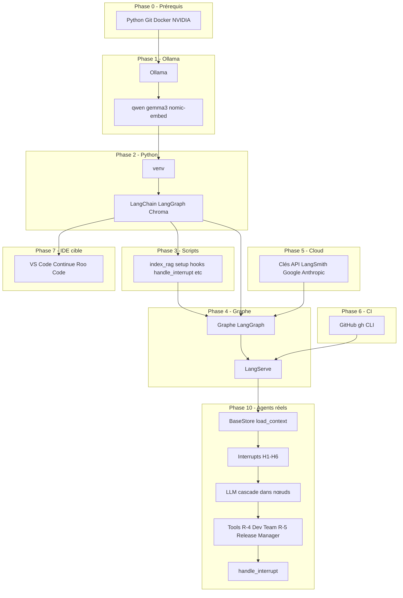
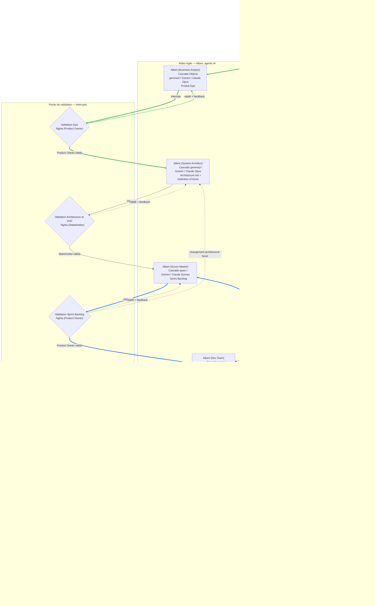
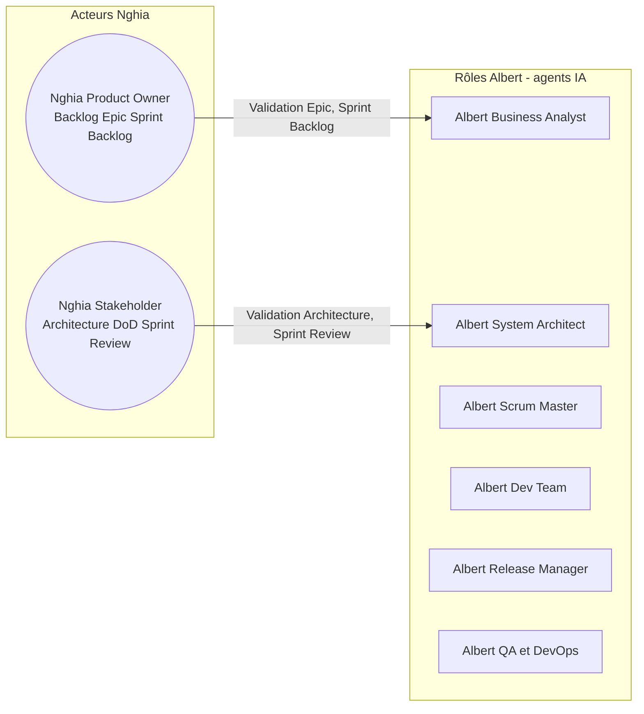

---


# Plan d'Implémentation — Écosystème Agile Agent IA sur Calypso

## Conventions

**Nomenclature 4D** : Toute action humaine est préfixée par `[ SOURCE > APP > VUE ] -> (CIBLE)`.


| Composant | Valeurs dans ce plan                            |
| --------- | ----------------------------------------------- |
| SOURCE    | `PC` (machine où tu tapes, Laptop Windows)      |
| APP       | `Cursor`, `Navigateur Web`, `PowerShell`        |
| VUE       | `Terminal`, `Chat`, `Éditeur`, `Explorateur`    |
| CIBLE     | `Calypso` (Linux RTX 3060), `Cloud` (sites web) |


**Règle d'exécution** : Tu es connecté à Calypso via Remote SSH depuis Cursor. Les commandes dans le Terminal Cursor s'exécutent sur Calypso sauf indication contraire.

**Bootstrap vs Cible** :

- **Bootstrap** : Pendant toute l'implémentation (Phases 0 à 8), tu restes dans **Cursor**. C'est l'outil qui exécute les commandes, édite les fichiers et pilote l'installation.
- **Cible** : L'IDE de l'écosystème (spec III.3, II) est **VS Code + Continue.dev + Roo Code**. Il est installé en Phase 7, une fois Ollama, LangGraph, scripts et comptes cloud opérationnels. Tu bascules vers cet IDE pour le travail quotidien (R-1 (Nghia (Product Owner)), R-7 (Nghia (Stakeholder))) : priorisation backlog, validation H1 (validation Epic)–H4 (Sprint Review), pair programming. Le flux automatisé (E4 (exécution code), E5 (tests CI)) reste piloté par LangGraph, pas par Roo Code.

---

## Vue d'ensemble des dépendances (ordre sans cycle)



---

## Schéma du Graphe d'Orchestration — Agents IA et Nghia

### Lexique des abréviations

| Code | Signification complète |
|------|------------------------|
| **R-0** | Albert (Business Analyst) — agent IA idéation |
| **R-1** | Nghia (Product Owner) — humain, garant vision produit |
| **R-2** | Albert (System Architect) — agent IA architecture |
| **R-3** | Albert (Scrum Master) — agent IA découpage sprint |
| **R-4** | Albert (Dev Team) — agent IA développement |
| **R-5** | Albert (Release Manager) — agent IA Git et releases |
| **R-6** | Albert (QA et DevOps) — agent IA tests et CI |
| **R-7** | Nghia (Stakeholder) — humain, sponsor et validateur |
| **E1** | Phase Idéation — Epic |
| **E2** | Phase Architecture et Definition of Done |
| **E3** | Phase Sprint Backlog (découpage) |
| **E4** | Phase Exécution code du sprint |
| **E5** | Phase Tests et Intégration continue locale |
| **E6** | Phase Clôture sprint et merge |
| **H1** | Interrupt — Validation Epic par Product Owner |
| **H2** | Interrupt — Validation Architecture et DoD par Stakeholder |
| **H3** | Interrupt — Validation Sprint Backlog par Product Owner |
| **H4** | Interrupt — Sprint Review et CI verts par Stakeholder |
| **H5** | Interrupt — Approbation escalade vers API payante Claude |
| **H6** | Interrupt — Résolution manuelle conflit Git |
| **DoD** | Definition of Done — Contrat d'acceptation |
| **CI** | Continuous Integration — Intégration continue |
| **CI1** | CI sur branche feature → develop (GitHub Actions) |
| **CI2** | CI sur branche develop → main (GitHub Actions) |

### Résumé du système

Le graphe LangGraph orchestre **7 agents IA** (Albert) et **2 rôles humains** (Nghia Product Owner, Nghia Stakeholder). Les humains interviennent via `interrupt()` aux 6 points de validation (H1 à H6), pilotés par `handle_interrupt.py`.

### Processus amont — De l'idée à l'Epic

Avant d'entrer dans le cycle Agile (sprints, program increment), un **processus amont** de Product Discovery transforme opportunités et idées en Epic validé :

1. **Discovery** — Exploration du problème, des utilisateurs, recherche, vision produit.
2. **Ideation** — Nghia (Product Owner) et Albert (Business Analyst) échangent : hypothèses, proposition de valeur, opportunité.
3. **Cristallisation** — Albert (Business Analyst) structure l'initiative en Epic (cahier des charges, critères de haut niveau).
4. **Validation de l'Epic** — Nghia (Product Owner) valide l'Epic (interrupt H1) avant injection dans le Product Backlog.

L'Epic validé est l'entrée du cycle E2 (Architecture) puis E3 (Sprint Backlog) et des sprints.

### Schéma Mermaid complet



**Convention visuelle** : `(())` = acteur humain (Nghia) ; `[]` = rôle Agile / agent IA (Albert) ; `{}` = point de validation (interrupt) ; `[[]]` = artefact ; `()` = phase.

**Flèches vertes** = boucle d'idéation entre Nghia (Product Owner) et Albert (Business Analyst) : Phase Idéation → Albert (Business Analyst) → Validation Epic par Nghia → approbation vers Architecture, ou rejet + feedback.

**Flèches bleues** = cycle nominal complet d'un sprint (tout se passe bien) : Phase Sprint Backlog → Albert (Scrum Master) → Validation Sprint Backlog → Albert (Dev Team) → Albert (Release Manager) → Albert (QA et DevOps) → Sprint Review validée → clôture → sprint suivant.

### Flux principaux

| Phase | Nœuds | Interrupt | Validateur |
| ------ | ------ | --------- | ---------- |
| **E1 Idéation** | load_context → Albert (Business Analyst) | Validation Epic | Nghia (Product Owner) |
| **E2 Architecture** | après validation → Albert (System Architect) | Validation Architecture et DoD | Nghia (Stakeholder) |
| **E3 Sprint Backlog** | après validation → Albert (Scrum Master) | Validation Sprint Backlog | Nghia (Product Owner) |
| **E4 Exécution** | après validation → Albert (Dev Team) → Albert (Release Manager) | — | Automatique |
| **E5 Tests** | Albert (Release Manager) → Albert (QA et DevOps) | Sprint Review et CI verts | Nghia (Stakeholder) |
| **E6 Clôture** | après Sprint Review → sprint_complete | — | Merge Git |

### Rôles et responsabilités



- **Nghia (Product Owner)** : valide l'Epic, le Sprint Backlog et l'escalade vers l'API payante.
- **Nghia (Stakeholder)** : valide l'Architecture et la Definition of Done, la Sprint Review et la résolution des conflits Git.

### Boucle Self-Healing (Albert QA et DevOps → Albert Dev Team)

- Si les tests (Phase E5) échouent : Albert (QA et DevOps) renvoie vers Albert (Dev Team) pour correction.
- Max 3 itérations (`SELF_HEALING_MAX_ITERATIONS=3`).
- Au-delà : interrupt pour approbation escalade vers API payante Claude.

---

## Table des matières

- [Conventions](#conventions)
- [Schéma du Graphe d'Orchestration — Agents IA et Nghia](#schéma-du-graphe-dorchestration--agents-ia-et-nghia)
- [Phase 0 — Prérequis système (Calypso)](#phase-0--prérequis-système-calypso)
- [Phase 1 — Ollama et modèles (Calypso)](#phase-1--ollama-et-modèles-calypso)
- [Phase 2 — Projet orchestration Python (Calypso)](#phase-2--projet-orchestration-python-calypso)
- [Phase 3 — Scripts opérationnels (Calypso)](#phase-3--scripts-opérationnels-calypso)
- [Phase 4 — Graphe LangGraph (Calypso)](#phase-4--graphe-langgraph-calypso)
- [Phase 5 — Comptes Cloud et clés API (Navigateur)](#phase-5--comptes-cloud-et-clés-api-navigateur)
- [Phase 6 — GitHub CLI et Docker (Calypso)](#phase-6--github-cli-et-docker-calypso)
- [Phase 7 — Installation de l'IDE cible (VS Code + Continue.dev + Roo Code)](#phase-7--installation-de-lide-cible-vs-code--continuedev--roo-code)
- [Phase 8 — Bootstrap du projet albert-agile](#phase-8--bootstrap-du-projet-albert-agile)
- [Phase 9 — Validation end-to-end](#phase-9--validation-end-to-end)
- [Phase 10 — Implémentation réelle des agents (logique métier)](#phase-10--implémentation-réelle-des-agents-logique-métier)
  - [10.3bis Gateway anonymisation cloud (L-ANON)](#103bis-gateway-anonymisation-cloud-l-anon)
- [Guide utilisateur basique — Initier un projet de développement](#guide-utilisateur-basique--initier-un-projet-de-développement)
- [Fichiers clés à créer/modifier](#fichiers-clés-à-créermodifier)
- [Points d'attention pour un débutant](#points-dattention-pour-un-débutant)

---

## Phase 0 — Prérequis système (Calypso)

Objectif : Vérifier que Calypso possède tout le nécessaire avant d'installer l'écosystème. Aucune dépendance circulaire.

### 0.1 Connexion SSH et identité Calypso

- [ PC > Cursor > Explorateur ] Ouvrir Cursor, menu **File > Connect to Host**, sélectionner ou ajouter `nghia-phan@calypso` (ou l'hôte configuré dans `~/.ssh/config`).
- [ PC > Cursor > Terminal ] Une fois connecté, le terminal affiche un prompt du type `user@calypso:~$`. Vérifier que tu es bien sur Calypso :

```
hostname && uname -a
```

- Résultat attendu : hostname contenant "calypso" (ou le nom de ta machine), Linux.

### 0.2 Vérifier Python 3.10+ et pip

- [ PC > Cursor > Terminal ] -> (Calypso)

```
python3 --version
pip3 --version
```

- Si Python < 3.10 : installer via `sudo apt update && sudo apt install -y python3.12 python3.12-venv python3-pip` (ou équivalent selon ta distro).

### 0.3 Vérifier Git

- [ PC > Cursor > Terminal ] -> (Calypso)

```
git --version
```

- Si absent : `sudo apt install -y git`

### 0.4 Vérifier Docker

- [ PC > Cursor > Terminal ] -> (Calypso)

```
docker --version
docker run hello-world
```

- Si absent : `sudo apt install -y docker.io` puis `sudo usermod -aG docker $USER`.

**INSTRUCTIONS À AFFICHER À L'HUMAIN (si Docker venait d'être installé)** : Déconnecte Cursor de Calypso (File > Close Remote Connection), reconnecte-toi (File > Connect to Host), puis reprends à l'étape 0.5. Le groupe `docker` n'est actif qu'après reconnexion.

### 0.5 Vérifier NVIDIA + pilote + VRAM

- [ PC > Cursor > Terminal ] -> (Calypso)

```
nvidia-smi
```

- Vérifier : "NVIDIA GeForce RTX 3060", "12288MiB" (12 Go). Si pilote manquant, installer les drivers NVIDIA appropriés (hors scope détaillé ici).

---

## Phase 1 — Ollama et modèles (Calypso)

Ollama est la base : LangGraph, index_rag et Cursor (via MCP (Model Context Protocol) optionnel) en dépendent. Aucune autre dépendance en amont.

### 1.1 Installer Ollama

- [ PC > Cursor > Terminal ] -> (Calypso)

```
curl -fsSL https://ollama.com/install.sh | sh
```

- Attendre la fin. Vérifier : `ollama --version`

### 1.2 Démarrer Ollama

- [ PC > Cursor > Terminal ] -> (Calypso) Vérifier d'abord si Ollama tourne déjà : `curl -s http://localhost:11434/api/tags` (si succès, passer à 1.3). Sinon :
  - Si installé via le script officiel (1.1) : `ollama serve &` (ou `nohup ollama serve &` pour persister). Attendre 2–3 s puis vérifier.
  - Si installé comme service système : `sudo systemctl start ollama` (Ubuntu/Debian avec paquet `.deb`).
- Vérifier : `curl http://localhost:11434/api/tags` — doit retourner du JSON (même vide).

### 1.3 Télécharger les modèles (ordre recommandé)

Chaque `ollama pull` peut prendre plusieurs minutes. Un seul modèle à la fois en VRAM sur RTX 3060.

- [ PC > Cursor > Terminal ] -> (Calypso)

```
ollama pull qwen2.5-coder:7b
```

- Puis :

```
ollama pull gemma3:12b-it-q4_K_M
```

- Puis :

```
ollama pull nomic-embed-text
```

- Vérifier : `ollama list` — les trois modèles apparaissent.

### 1.4 Configurer OLLAMA_KEEP_ALIVE (RTX 3060)

- [ PC > Cursor > Terminal ] -> (Calypso) Ajouter à `~/.bashrc` de manière **idempotente** (évite duplication si le plan est relancé) :

```
grep -q 'OLLAMA_KEEP_ALIVE' ~/.bashrc || echo 'export OLLAMA_KEEP_ALIVE=qwen2.5-coder:7b' >> ~/.bashrc
source ~/.bashrc
```

- Cette variable évite le déchargement du modèle pendant E4 (exécution code) / E5 (tests CI). Pour Phase 0 / E2 (architecture), tu peux optionnellement passer à `gemma3:12b-it-q4_K_M` avant de lancer ces phases.

---

## Phase 2 — Projet orchestration Python (Calypso)

Le dépôt `albert-agile` sert de projet orchestration. On crée l'environnement Python et les dépendances.

### 2.1 Aller dans le projet et créer un venv propre

- [ PC > Cursor > Terminal ] -> (Calypso)

```
cd /home/nghia-phan/PROJECTS_WITH_ALBERT/albert-agile
```

- Si un ancien `.venv` existe et contient des packages non conformes à la spec (ex. langchain_huggingface), le supprimer et recréer :

```
rm -rf .venv
python3 -m venv .venv
source .venv/bin/activate
```

### 2.2 Installer les packages Python (spec III.5, checklist 4.1)

- [ PC > Cursor > Terminal ] -> (Calypso) Avec le venv activé (`(.venv)` visible dans le prompt) :

```
pip install --upgrade pip
pip install langgraph langchain langchain-ollama langchain-anthropic langchain-google-genai langchain-chroma pydantic chromadb fastapi uvicorn python-dotenv
```

- Ces packages couvrent : LangGraph, LangChain, connecteurs Ollama/Anthropic/Google, Chroma, Pydantic, LangServe (FastAPI).

### 2.3 Créer la structure des répertoires

- [ PC > Cursor > Terminal ] -> (Calypso)

```
mkdir -p scripts config logs chroma_db
```

- `chroma_db` : stockage persistant Chroma. `logs` : rapports index_rag, pending_index, etc.

### 2.4 Créer ou mettre à jour config/projects.json

- [ PC > Cursor > Éditeur ] -> (Calypso) Ouvrir `config/projects.json`. **Ne pas écraser** les clés `_comment` et `_exemple` si présentes ; fusionner ou ajouter le bloc `albert-agile` au lieu de remplacer tout le fichier. Format attendu pour le bloc projet (spec III.8-G) :

```json
{
  "albert-agile": {
    "path": "/home/nghia-phan/PROJECTS_WITH_ALBERT/albert-agile",
    "auto_next_sprint": false,
    "archived": false,
    "github_repo": "nghiaphan31/albert-agile"
  }
}
```

- Ajouter d'autres projets plus tard en dupliquant ce bloc avec un autre `path` et `github_repo`.

### 2.5 Définir les variables AGILE_* dans ~/.bashrc (idempotent)

- [ PC > Cursor > Terminal ] -> (Calypso) Ajouter **sans duplication** :

```
grep -q 'AGILE_ORCHESTRATION_ROOT' ~/.bashrc || {
  echo 'export AGILE_ORCHESTRATION_ROOT=/home/nghia-phan/PROJECTS_WITH_ALBERT/albert-agile' >> ~/.bashrc
  echo 'export AGILE_PROJECTS_JSON=$AGILE_ORCHESTRATION_ROOT/config/projects.json' >> ~/.bashrc
}
source ~/.bashrc
```

---

## Phase 3 — Scripts opérationnels (Calypso)

Les scripts sont créés dans `scripts/`. L'ordre respecte les dépendances : `index_rag.py` existe déjà ; on complète les autres.

### 3.1 Vérifier index_rag.py

- [ PC > Cursor > Éditeur ] -> (Calypso) Ouvrir [scripts/index_rag.py](scripts/index_rag.py). S'assurer qu'il supporte :
  - `--project-root`, `--project-id`, `--sources` (backlog|architecture|code|all)
  - Option `--incremental` si implémentée
  - Logs dans `logs/index_rag_<timestamp>.log`

### 3.2 Créer setup_project_hooks.sh

- [ PC > Cursor > Éditeur ] -> (Calypso) Créer `scripts/setup_project_hooks.sh` avec le contenu suivant (signature spec III.8-C) :

```bash
#!/bin/bash
# Usage: ./setup_project_hooks.sh --orchestration-root <path> --project-root <path> --project-id <id>

ORCH_ROOT=""
PROJECT_ROOT=""
PROJECT_ID=""
while [[ $# -gt 0 ]]; do
  case $1 in
    --orchestration-root) ORCH_ROOT="$2"; shift 2 ;;
    --project-root) PROJECT_ROOT="$2"; shift 2 ;;
    --project-id) PROJECT_ID="$2"; shift 2 ;;
    *) echo "Usage: $0 --orchestration-root <path> --project-root <path> --project-id <id>"; exit 2 ;;
  esac
done

[ -z "$ORCH_ROOT" ] || [ -z "$PROJECT_ROOT" ] || [ -z "$PROJECT_ID" ] && { echo "Missing args"; exit 2; }

echo "$PROJECT_ID" > "$PROJECT_ROOT/.agile-project-id"
cat > "$PROJECT_ROOT/.agile-env" << EOF
AGILE_ORCHESTRATION_ROOT=$ORCH_ROOT
AGILE_PROJECT_ID=$PROJECT_ID
AGILE_DEFER_INDEX=true
AGILE_PROJECTS_JSON=$ORCH_ROOT/config/projects.json
AGILE_RAG_FILE_WATCHER=false
AGILE_RAG_INCREMENTAL=false
AGILE_BASESTORE_STRICT=true
AGILE_INTERRUPT_TIMEOUT_HOURS=48
SYNC_ARTIFACTS_CRON="0 0 * * 0"
EOF

# Hook Git post-commit (spec III.8-C) : indexation différée ou pending_index.log
HOOK_FILE="$PROJECT_ROOT/.git/hooks/post-commit"
mkdir -p "$PROJECT_ROOT/.git/hooks"
cat > "$HOOK_FILE" << 'HOOK'
#!/bin/bash
ROOT="$(git rev-parse --show-toplevel)"
[ -f "$ROOT/.agile-env" ] && source "$ROOT/.agile-env"
ORCH="${AGILE_ORCHESTRATION_ROOT:-}"
PID="${AGILE_PROJECT_ID:-}"
[ -z "$PID" ] && [ -f "$ROOT/.agile-project-id" ] && PID=$(cat "$ROOT/.agile-project-id")
[ -z "$ORCH" ] || [ -z "$PID" ] && exit 0
mkdir -p "$ORCH/logs"
if [ "${AGILE_DEFER_INDEX:-true}" = "true" ]; then
  echo "$(date -Iseconds) $(git rev-parse HEAD) $PID" >> "$ORCH/logs/pending_index.log"
else
  python "$ORCH/scripts/index_rag.py" --project-root "$ROOT" --project-id "$PID" 2>/dev/null || true
fi
HOOK
chmod +x "$HOOK_FILE"

cd "$PROJECT_ROOT"
git checkout -b develop main 2>/dev/null || true
git push -u origin develop 2>/dev/null || true
```

- [ PC > Cursor > Terminal ] -> (Calypso) Rendre exécutable :

```
chmod +x scripts/setup_project_hooks.sh
```

### 3.3 Créer handle_interrupt.py

- [ PC > Cursor > Éditeur ] -> (Calypso) Créer `scripts/handle_interrupt.py` (spec III.8-B). Ce script :
  - Accepte `--thread-id <id>` optionnel
  - Si omis : liste les threads en attente (API LangServe ou accès direct au checkpointer), triés par project_id puis H1 (validation Epic)→H6 (résolution conflit Git)
  - Affiche le payload `__interrupt_`_, demande `approved` | `rejected` | `feedback`
  - Envoie `graph.invoke(Command(resume=...), config)`
  - Exit codes : 0 succès, 1 erreur, 2 usage
- Implémentation minimale : appeler l'API LangServe `POST /runs/{thread_id}/resume` avec le payload. Si LangServe n'est pas encore déployé, le script peut être un stub qui affiche "À implémenter : appeler LangServe quand le graphe tourne".

### 3.4 Créer purge_checkpoints.py

- [ PC > Cursor > Éditeur ] -> (Calypso) Créer `scripts/purge_checkpoints.py` (spec III.8-L) :

```python
#!/usr/bin/env python3
"""Purge des checkpoints > max-age-days. Exclut les threads avec __interrupt__ non résolu."""
import argparse
# ... (implémentation : lire SqliteSaver, supprimer les checkpoints des threads dont last_step > max_age_days, exclure si __interrupt__)
```

- Signature : `--dry-run`, `--max-age-days 90`, `--protect-active-sprints` (défaut true).

### 3.5 Créer export_chroma.py et import_chroma.py

- [ PC > Cursor > Éditeur ] -> (Calypso) Créer `scripts/export_chroma.py` : `--project-id <id> --output <path>.json`
- Créer `scripts/import_chroma.py` : `--project-id <id> --input <path>.json`
- Ces scripts sérialisent/désérialisent la collection Chroma du projet (spec III.8-L, S10).

### 3.6 Créer notify_pending_interrupts.py

- [ PC > Cursor > Éditeur ] -> (Calypso) Créer `scripts/notify_pending_interrupts.py` (spec F5 (notification interrupt > 48h), III.8-B). Logique :
  - Parcourt les threads avec interrupt en attente
  - Si durée > AGILE_INTERRUPT_TIMEOUT_HOURS (48) : écrit dans `logs/pending_interrupts_alert.log`
  - Si AGILE_NOTIFY_CMD défini : exécute cette commande (ex. email, webhook)

### 3.7 Créer status.py

- [ PC > Cursor > Éditeur ] -> (Calypso) Créer `scripts/status.py` (spec III.8-P, F6 (status multi-projets)). Signature : `--project-id <id>`, `--json`. Affiche : project_id, phase_courante, interrupts_en_attente, dernière_indexation_rag, pending_index, alertes.

---

## Phase 4 — Graphe LangGraph (Calypso)

C'est le cœur du système. Ordre : d'abord le graphe minimal avec load_context, puis les nœuds R-0 (Albert Business Analyst) à R-6 (Albert QA & DevOps), puis LangServe.

### 4.1 Créer le module graphe (structure)

- [ PC > Cursor > Éditeur ] -> (Calypso) Créer `src/` ou `graph/` à la racine du projet. Exemple : `graph/state.py`, `graph/nodes.py`, `graph/graph.py`.

### 4.2 Définir l'état TypedDict (spec III.5bis)

- [ PC > Cursor > Éditeur ] -> (Calypso) Dans `graph/state.py` :

```python
from typing import TypedDict
from pathlib import Path

class State(TypedDict, total=False):
    project_root: Path
    project_id: str
    sprint_number: int
    adr_counter: int
    needs_architecture_review: bool
    dod: dict | None
    # ... Backlog, Architecture, SprintBacklog, messages, etc.
```

### 4.3 Implémenter load_context (spec III.8-A)

- [ PC > Cursor > Éditeur ] -> (Calypso) Nœud `load_context` :
  1. Lit BaseStore (mémoire long terme) : `project/{id}/adr_counter`, `project/{id}/sprint_number`, `project/{id}/dod/{sprint_number}` (le champ `State` est `sprint_number`, pas `sprint_counter`)
  2. Gère AGILE_BASESTORE_STRICT (spec F10 (AGILE_BASESTORE_STRICT))
  3. Le routing E1→r0 / E3→r3 / HOTFIX→r4 est géré par `_route_from_load_context` dans `graph.py` — `load_context` injecte juste `start_phase` dans l'état et crée le SprintBacklog synthétique si HOTFIX

### 4.4 Implémenter la cascade N0 (local Ollama)→N1 (cloud gratuit)→N2 (cloud payant) (spec III.5, F8 (cascade échec N0))

- [ PC > Cursor > Éditeur ] -> (Calypso) Créer `graph/cascade.py` avec `call_with_cascade(llm_n0, llm_n1, llm_n2, prompt, schema)`. Toute exception Ollama (OOM, timeout, ConnectionError) → escalade N1 (cloud gratuit). Log structuré `n0_failure`. Retry HTTP 429 avec backoff (API_429_MAX_RETRIES=3).

### 4.5 Implémenter les nœuds R-0 (Albert Business Analyst) à R-6 (Albert QA & DevOps)

- Chaque nœud est une fonction `def node_r0(state: State) -> dict: ...`. R-4 (Albert Dev Team) utilise les tools `read_file`, `write_file` (atomique, spec F9 (write_file atomique)), `run_shell`. R-5 (Albert Release Manager) utilise `run_shell` pour Git.

### 4.6 Configurer le checkpointer (SqliteSaver)

- [ PC > Cursor > Éditeur ] -> (Calypso) Chemin par défaut : `$AGILE_ORCHESTRATION_ROOT/checkpoints.sqlite` ou sous-dossier `data/`.

### 4.7 Configurer Chroma et BaseStore (mémoire long terme)

- Chroma : `chroma_db/` (déjà créé). BaseStore (mémoire long terme) : PostgresStore (pgvector) si Postgres dispo, sinon store custom basé sur Chroma ou fichier JSON (mode dégradé).

### 4.8 Exposer via LangServe (FastAPI)

- [ PC > Cursor > Éditeur ] -> (Calypso) Créer `serve.py` à la racine. Structure attendue pour que `uvicorn serve:app` fonctionne :

```python
# serve.py
from dotenv import load_dotenv
load_dotenv()

from langserve import add_routes
from fastapi import FastAPI
from graph.graph import graph  # le graphe compilé

app = FastAPI(title="Agile Graph")
add_routes(app, graph, path="/agile")
# Ou selon API LangServe : add_routes(app, graph.with_config(...), path="/agile")
```

### 4.9 Créer run_graph.py (script Python)

- [ PC > Cursor > Éditeur ] -> (Calypso) Script Python CLI, invocable par : `python run_graph.py --project-id <id> --start-phase E1 (idéation)|E3 (Sprint Backlog)|HOTFIX (correctif urgent) --thread-id <id>-phase-0|<id>-sprint-02|...`. Pour HOTFIX (correctif urgent) : `--hotfix-description "..."`. Toujours exécuter avec le venv activé : `source .venv/bin/activate` avant, ou utiliser `.venv/bin/python run_graph.py`.

---

## Phase 5 — Comptes Cloud et clés API (Navigateur)

**ARRÊT : action humaine requise.** L'agent ne peut pas créer de comptes ni récupérer de clés. Cette phase est exécutée par Nghia.

**INSTRUCTIONS À AFFICHER À L'HUMAIN (quand l'agent atteint cette phase)** :

> Nghia, voici les actions manuelles à effectuer :
>
> 1. **LangSmith** : Ouvre [https://smith.langchain.com](https://smith.langchain.com) → Crée un compte → Génère une clé API → Ouvre le fichier `.env` à la racine du projet (crée-le si absent, à partir de `.env.example`) et ajoute `LANGCHAIN_TRACING_V2=true` et `LANGCHAIN_API_KEY=<ta_clé>` (remplace par la vraie clé).
> 2. **Google AI Studio** : Ouvre [https://aistudio.google.com](https://aistudio.google.com) → Crée une clé API → Ajoute `GOOGLE_API_KEY=<ta_clé>` dans `.env`.
> 3. **Anthropic** : Ouvre [https://console.anthropic.com](https://console.anthropic.com) → Crée une clé API → Ajoute `ANTHROPIC_API_KEY=<ta_clé>` dans `.env`.
> 4. Quand c'est fait, dis « Phase 5 terminée » pour que l'agent poursuive.

Aucune dépendance circulaire : les clés sont nécessaires au graphe mais le graphe peut être codé avant. **Sécurité** : les clés ne doivent jamais être commitées. Utiliser un fichier `.env` à la racine du projet (déjà dans `.gitignore`).

### 5.1 Créer le fichier .env.example (template sans secrets)

- [ PC > Cursor > Éditeur ] -> (Calypso) Créer `$AGILE_ORCHESTRATION_ROOT/.env.example` :

```
# Copier vers .env et remplir les valeurs. Ne jamais commiter .env
LANGCHAIN_TRACING_V2=true
LANGCHAIN_API_KEY=
GOOGLE_API_KEY=
ANTHROPIC_API_KEY=
```

### 5.2 LangSmith

- [ PC > Navigateur Web ] -> (Cloud) Aller sur [https://smith.langchain.com](https://smith.langchain.com). Créer un compte. Créer une clé API.
- [ PC > Cursor > Éditeur ] -> (Calypso) Créer ou éditer `.env` à la racine du projet. Ajouter `LANGCHAIN_API_KEY=<ta_clé>` (coller la vraie clé). Ne pas commiter ce fichier.

### 5.3 Google AI Studio

- [ PC > Navigateur Web ] -> (Cloud) Aller sur [https://aistudio.google.com](https://aistudio.google.com). Créer une clé API.
- [ PC > Cursor > Éditeur ] -> (Calypso) Ajouter `GOOGLE_API_KEY=<ta_clé>` dans `.env`.

### 5.4 Anthropic

- [ PC > Navigateur Web ] -> (Cloud) Aller sur [https://console.anthropic.com](https://console.anthropic.com). Créer une clé API.
- [ PC > Cursor > Éditeur ] -> (Calypso) Ajouter `ANTHROPIC_API_KEY=<ta_clé>` dans `.env`.

### 5.5 Charger .env au démarrage

- Les scripts Python (run_graph, serve, etc.) doivent charger `.env` via `python-dotenv` : `from dotenv import load_dotenv; load_dotenv()` au démarrage. Ou : `export $(grep -v '^#' .env | xargs)` avant de lancer les commandes (dans un wrapper ou manuellement).

### 5.6 GitHub

- [ PC > Navigateur Web ] -> (Cloud) Avoir un compte GitHub. Pour CI/CD, privilégier un dépôt public (Actions illimité).

---

## Phase 6 — GitHub CLI et Docker (Calypso)

**ARRÊT : action humaine requise.** `gh auth login` est interactif (choix méthode, ouverture navigateur). L'agent ne peut pas le terminer seul.

**INSTRUCTIONS À AFFICHER À L'HUMAIN (quand l'agent atteint cette phase)** :

> Nghia, exécute manuellement dans le terminal : `gh auth login`
>
> - Choisis « GitHub.com » → « HTTPS » → « Login with a web browser » (ou token si tu préfères).
> - Copie le code affiché (ex. XXXX-XXXX), appuie sur Entrée, authentifie-toi dans le navigateur qui s'ouvre.
> - Quand tu vois « Logged in as nghiaphan31 » (ou ton login), dis « Phase 6 terminée » pour que l'agent poursuive.

### 6.1 Installer gh (GitHub CLI)

- [ PC > Cursor > Terminal ] -> (Calypso)

```
sudo apt install -y gh
```

- [ PC > Cursor > Terminal ] -> (Calypso) **Action humaine** : lancer `gh auth login` et suivre les invites. Une seule fois.

### 6.2 Vérifier Docker

- Déjà fait en Phase 0. Les tests R-6 (Albert QA & DevOps) utiliseront Docker pour l'isolation.

---

## Phase 7 — Installation de l'IDE cible (VS Code + Continue.dev + Roo Code)

**ARRÊT : action humaine requise.** Télécharger VS Code, l'installer, configurer les extensions sont des actions sur le poste local. L'agent ne peut pas les exécuter. Cette phase est réalisée manuellement par Nghia.

**INSTRUCTIONS À AFFICHER À L'HUMAIN (quand l'agent atteint cette phase)** :

> Nghia, cette phase est entièrement manuelle sur ton PC :
>
> 1. **Télécharger VS Code** : Ouvre [https://code.visualstudio.com/](https://code.visualstudio.com/) → Télécharge la version stable pour ton OS (ex. Windows) → Installe-le.
> 2. **Remote-SSH** : Dans VS Code, Extensions (Ctrl+Shift+X) → Recherche « Remote - SSH » → Installe (Microsoft).
> 3. **Connexion à Calypso** : Ctrl+Shift+P → « Remote-SSH: Connect to Host » → Ajoute ou sélectionne `nghia-phan@calypso` (ou ton hôte SSH).
> 4. **Continue.dev** : Une fois connecté à Calypso, Extensions → « Continue » (continue.dev) → Installe. Paramètres Continue : Modèles → Ollama → URL `http://localhost:11434` → Modèles `qwen2.5-coder:7b`, `gemma3:12b-it-q4_K_M`.
> 5. **Roo Code** : Extensions → « Roo Code » → Installe. Même config Ollama : `http://localhost:11434`.
> 6. Quand c'est fait, dis « Phase 7 terminée » pour que l'agent poursuive (ou considère le plan complet).

L'IDE cible de l'écosystème (spec III.3, II) est VS Code + Continue.dev + Roo Code. Cette phase s'exécute **une fois** Ollama, LangGraph, les scripts et les comptes cloud en place. Jusque-là, tu continues à utiliser Cursor en bootstrap.

**Contexte** : VS Code tourne sur ton PC (ou sur Calypso si bureau graphique). Il se connecte à Calypso via Remote-SSH. Continue.dev et Roo Code s'exécutent dans le contexte distant (Calypso), donc ils accèdent à Ollama sur `http://localhost:11434` (localhost = Calypso).

### 7.1 Installer VS Code

- [ PC > Navigateur Web ] -> (Cloud) Télécharger VS Code depuis [https://code.visualstudio.com/](https://code.visualstudio.com/) (version stable pour ton OS, ex. Windows).
- [ PC > Explorateur de fichiers ] Installer VS Code (exécuter l'installateur téléchargé).
- [ PC > VS Code > Extensions ] Installer l'extension **Remote - SSH** (Microsoft). Indispensable pour se connecter à Calypso.

### 7.2 Se connecter à Calypso depuis VS Code

- [ PC > VS Code > Terminal ou palette Ctrl+Shift+P ] Ouvrir la palette de commandes, taper `Remote-SSH: Connect to Host`, sélectionner ou ajouter `nghia-phan@calypso` (ou ton hôte SSH).
- VS Code ouvre une nouvelle fenêtre connectée à Calypso. Le Terminal intégré exécute les commandes sur Calypso.

### 7.3 Installer Continue.dev

- [ PC > VS Code > Extensions ] (fenêtre connectée à Calypso) Rechercher et installer **Continue** (continue.dev).
- [ PC > VS Code > Paramètres Continue ] Configurer :
  - **Modèles** : ajouter Ollama, URL `http://localhost:11434`
  - Modèles à utiliser : `qwen2.5-coder:7b`, `gemma3:12b-it-q4_K_M`
  - Option RAG (recherche sémantique) partagé (spec III.7-bis) : si chroma-mcp est installé sur Calypso, configurer dans `.continue/mcpServers/` pour pointer vers le même Chroma que `index_rag`

### 7.4 Installer Roo Code

- [ PC > VS Code > Extensions ] (fenêtre connectée à Calypso) Rechercher et installer **Roo Code**.
- Configurer Ollama de la même manière : `http://localhost:11434`, modèles `qwen2.5-coder:7b` / `gemma3:12b-it-q4_K_M`.

### 7.5 chroma-mcp (optionnel, pour RAG (recherche sémantique) partagé IDE + agents)

- [ PC > Cursor > Terminal ] -> (Calypso) Avec le venv activé :

```
pip install chroma-mcp
```

- [ PC > VS Code > Éditeur ] -> (Calypso) Configurer chroma-mcp dans Continue : fichier `.continue/mcpServers/` ou équivalent, pointer vers `$AGILE_ORCHESTRATION_ROOT/chroma_db`. Permet à Continue (et donc à R-1 (Nghia (Product Owner)) / R-7 (Nghia (Stakeholder))) d'utiliser le même index RAG (recherche sémantique) que les agents LangGraph.

### 7.6 Recommandation RTX 3060 (spec III.8-J, CC2)

- Pendant E4 (exécution code) / E5 (tests CI), si VS Code + Continue ou Roo Code restent ouverts, les configurer sur **qwen2.5-coder:7b** pour éviter le swapping de modèles (un seul modèle en VRAM sur RTX 3060). Alternative : désactiver l'autocomplétion IA pendant E4 (exécution code)/E5 (tests CI).

---

## Phase 8 — Bootstrap du projet albert-agile

Applique les hooks et la config au projet orchestration lui-même (ou à un projet pilote).

### 8.1 Lancer setup_project_hooks sur albert-agile

- [ PC > Cursor > Terminal ] -> (Calypso)

```
cd /home/nghia-phan/PROJECTS_WITH_ALBERT/albert-agile
source .venv/bin/activate
./scripts/setup_project_hooks.sh \
  --orchestration-root /home/nghia-phan/PROJECTS_WITH_ALBERT/albert-agile \
  --project-root /home/nghia-phan/PROJECTS_WITH_ALBERT/albert-agile \
  --project-id albert-agile
```

- Vérifier : `.agile-project-id` et `.agile-env` existent à la racine.

### 8.2 Hook Git post-commit

- Le hook est créé automatiquement par `setup_project_hooks.sh` (voir Phase 3.2). Il source `.agile-env`, écrit dans `pending_index.log` si AGILE_DEFER_INDEX=true, sinon lance `index_rag.py`.

### 8.3 Premier index RAG (recherche sémantique)

- [ PC > Cursor > Terminal ] -> (Calypso) **Activer le venv** puis lancer :

```
cd /home/nghia-phan/PROJECTS_WITH_ALBERT/albert-agile
source .venv/bin/activate
python scripts/index_rag.py --project-root /home/nghia-phan/PROJECTS_WITH_ALBERT/albert-agile --project-id albert-agile --sources all
```

- Vérifier : `logs/index_rag_*.log` créé, pas d'erreur fatale.

---

## Phase 9 — Validation end-to-end

### 9.1 Démarrer LangServe (si implémenté)

- [ PC > Cursor > Terminal ] -> (Calypso) **Activer le venv** (chaque nouveau terminal le perd) :

```
cd /home/nghia-phan/PROJECTS_WITH_ALBERT/albert-agile
source .venv/bin/activate
uvicorn serve:app --host 0.0.0.0 --port 8000
```

- [ PC > Navigateur Web ] Ouvrir [http://calypso:8000/playground](http://calypso:8000/playground) (ou localhost si tunnel SSH). Vérifier que le graphe est exposé.

### 9.2 Lancer un run Phase 0 (E1 idéation)

- [ PC > Cursor > Terminal ] -> (Calypso) Avec venv activé :

```
source .venv/bin/activate
python run_graph.py --project-id albert-agile --start-phase E1 --thread-id albert-agile-phase-0
```

- Le graphe doit atteindre H1 (validation Epic). Utiliser `handle_interrupt.py` pour valider.

### 9.3 Vérifier status.py

- [ PC > Cursor > Terminal ] -> (Calypso) Avec venv activé :

```
source .venv/bin/activate
python scripts/status.py
```

- Doit afficher l'état des projets (au moins albert-agile).

---

## Phase 10 — Implémentation réelle des agents (logique métier)

**Objectif** : Passer des stubs aux nœuds fonctionnels. Les Phases 0–9 ont mis en place l'infrastructure (graphe, cascade, scripts, Chroma). Cette phase implémente la logique des agents : LLM, interrupts H1–H6, tools, BaseStore, RAG.

**Références** : spec `Specifications Ecosysteme Agile Agent IA.md` III.5, III.6, III.8 ; plan `~/.cursor/plans/lois_albert_core_pour_agents_agile_*.plan.md` ; nomenclature [NOMENCLATURE_R_H_E.md](../NOMENCLATURE_R_H_E.md).

### 10.0 Lois Albert Core — laws.py et REGLES_AGENTS_AGILE (plan lois)

- [ PC > Cursor > Éditeur ] -> (Calypso) Créer `specs/REGLES_AGENTS_AGILE.md` :
  - Synthèse opérationnelle : mapping lois→agents (L0, L3, L7, L8, L9, L11, L18 transverses ; L-ANON Anonymisation cloud transversale ; L1, L2, L4, L5, L6, L15, L19, L21 par rôle)
  - Règles A (commandes par ligne), B (tableaux Markdown), C (prompts YAML), D (doc-in-code)
  - Règles Tests (unit→intégration→E2E)
  - Règles validation R-1 (Nghia (Product Owner))/R-7 (Nghia (Stakeholder))
- [ PC > Cursor > Éditeur ] -> (Calypso) Créer `graph/laws.py` (module Python, **pas** un YAML — le reste du plan importe `from graph.laws import LAWS`) :
  - Les 21 lois + L21 (Doc-as-code / Doc-in-code) + Règles A/B/C/D + Règles Tests, en format structuré (dict ou dataclasses)
  - Chargé par chaque nœud pour injection dans le system prompt
  - Référence : plan lois §5.1, §5.2

### 10.1 BaseStore et load_context complet (spec III.8-A, F10)

- [ PC > Cursor > Éditeur ] -> (Calypso) Implémenter un BaseStore (mémoire long terme) :
  - **Mode dégradé** : store custom basé sur JSON (`data/basestore/{project_id}/*.json`) ou Chroma avec namespace
  - **Mode production** : PostgresStore (pgvector) si Postgres dispo
  - Namespaces : `project/{id}/adr_counter`, `project/{id}/sprint_number`, `project/{id}/dod/{sprint_number}` (DoD = Definition of Done), `project/{id}/architecture`, `project/{id}/sprints`
    (**Attention** : le champ dans `State` s'appelle `sprint_number`, pas `sprint_counter` — utiliser le même nom dans le BaseStore)
- [ PC > Cursor > Éditeur ] -> (Calypso) Compléter `load_context` dans `graph/nodes.py` :
  1. `project_root` est déjà résolu depuis `config/projects.json` (implémenté — ne pas refaire)
  2. Charger `adr_counter`, `sprint_number`, `dod` depuis le BaseStore JSON (`data/basestore/{project_id}/*.json`)
  3. Gérer `AGILE_BASESTORE_STRICT` (F10 résilience BaseStore) : si `false` et BaseStore inaccessible → valeurs par défaut + WARNING ; si `true` → exception (déjà géré pour `project_root`, appliquer le même pattern)
  4. **SprintBacklog synthétique HOTFIX** : si `start_phase == "HOTFIX"` et `hotfix_description` non vide, créer un `sprint_backlog` synthétique `{"id": "HF-001", "description": state["hotfix_description"], "tickets": []}` et l'injecter dans l'état. **NE PAS réimplémenter le routing** dans `load_context` — le routing E1→r0 / E3→r3 / HOTFIX→r4 est déjà géré par `_route_from_load_context` dans `graph/graph.py` via `add_conditional_edges`
  5. Retourner le dict de valeurs à injecter dans l'état (project_root, sprint_number, adr_counter, dod, et sprint_backlog si HOTFIX)

### 10.2 Interrupts H1–H6 (spec III.6, III.8-B)

- [ PC > Cursor > Éditeur ] -> (Calypso) Modifier le graphe dans `graph/graph.py` :
  - H1 (validation Epic) : fin R-0 (Albert Business Analyst) ; H2 (validation Architecture + DoD) : fin R-2 (Albert System Architect) ; H3 (validation Sprint Backlog) : fin R-3 (Albert Scrum Master) ; H4 (Sprint Review) : fin R-5 (Albert Release Manager)/R-6 (Albert QA & DevOps) ; H5 (approbation escalade API payante) : sur escalade N2 (cloud payant) ; H6 (résolution conflit Git) : sur conflit Git
  - **API à utiliser : `interrupt()` depuis `langgraph.types`, PAS `raise NodeInterrupt`.** La différence est critique pour les rebouclages sur feedback :
    - `interrupt()` suspend le nœud ET retourne la valeur du `Command(resume=...)` au nœud quand il reprend → permet au nœud d'injecter le feedback humain dans son traitement
    - `raise NodeInterrupt(value=...)` stoppe le nœud comme une exception → le nœud ne peut pas utiliser la réponse humaine, donc les branches "rejected avec feedback" ne peuvent pas reboucler correctement
  - Pattern correct à utiliser dans chaque nœud :
    ```python
    from langgraph.types import interrupt
    # En fin de nœud, avant de retourner :
    human_response = interrupt({"reason": "H1", "payload": gros_ticket.model_dump()})
    # human_response contient Command(resume=...).resume quand repris par handle_interrupt.py
    # Ex: {"status": "approved"} ou {"status": "rejected", "feedback": "..."}
    if isinstance(human_response, dict) and human_response.get("status") == "rejected":
        feedback = human_response.get("feedback", "")
        # injecter feedback dans l'état et reboucler
        return {"h1_feedback": feedback, ...}
    ```
  - Chaque interrupt retourne un payload JSON (`reason`, données du nœud correspondant)
- [ PC > Cursor > Éditeur ] -> (Calypso) Gérer les **branches rejected** : `Command(resume={"status":"rejected","feedback":"..."})` → `interrupt()` retourne `{"status":"rejected","feedback":"..."}` au nœud → injecter feedback dans état, reboucler vers le nœud précédent (R-0 Albert Business Analyst, R-2 Albert System Architect, R-3 Albert Scrum Master). Limite 3 cycles → H5 (approbation escalade API payante).
- Référence : spec III.8-B, tableau H1–H6

### 10.3 Intégration LLM (cascade) dans les nœuds (spec III.5, F8, plan lois)

- [ PC > Cursor > Éditeur ] -> (Calypso) Dans `graph/nodes.py`, remplacer les stubs par des appels réels :
  - R-0 (Albert Business Analyst), R-2 (Albert System Architect) : `ChatOllama(gemma3:12b-it-q4_K_M)` → `ChatGoogleGenerativeAI(gemini-2.5-flash)` → `ChatAnthropic(claude-opus-4-5)` via `call_with_cascade`
  - R-3 (Albert Scrum Master), R-4 (Albert Dev Team), R-5 (Albert Release Manager), R-6 (Albert QA & DevOps) : `ChatOllama(qwen2.5-coder:7b)` → Gemini → `ChatAnthropic(claude-sonnet-4-5)`
  - **Note** : vérifier les identifiants de modèles Anthropic disponibles au moment de l'implémentation via `python -c "import anthropic; print(anthropic.Anthropic().models.list())"` — les noms ci-dessus (`claude-opus-4-5`, `claude-sonnet-4-5`) correspondent aux modèles Claude 4 series attendus en 2026 ; adapter si nécessaire (ex. `claude-3-7-sonnet-20250219` pour Sonnet, `claude-opus-4-5` pour Opus)
  - Créer des prompts système par rôle dans `graph/prompts/` ou `config/prompts/` (Règle C : templates en bloc texte avec frontmatter YAML)
  - **Injection des lois** : pour chaque nœud, charger `graph/laws.py` et injecter les lois applicables au rôle dans le system prompt (ex. R-0 (Albert Business Analyst) : L1 Anti-précipitation, L4 Gabarit CDC ; R-4 (Albert Dev Team) : L8, L9, L19, L21, Règles Tests)
  - Règle B : Backlog, Architecture, Sprint Backlog en **tableaux Markdown**
  - Utiliser `with_structured_output(Schema)` (Pydantic) pour Epic, Sprint Backlog, Architecture, tickets
  - Sur escalade N2 (cloud payant) : déclencher H5 (approbation escalade API payante) avant d'appeler Claude. **Implémentation** : dans `graph/cascade.py`, juste avant le bloc N2, appeler `interrupt({"reason": "H5", "payload": {"escalation": "N2_claude", "context": prompt[:200]}})`. `interrupt()` est importable depuis `langgraph.types` et peut être appelé depuis `cascade.py` car celui-ci s'exécute dans le contexte d'un nœud LangGraph actif. Exemple :
    ```python
    # Dans cascade.py, avant l'appel N2 :
    from langgraph.types import interrupt as lg_interrupt
    human_ok = lg_interrupt({"reason": "H5", "payload": {"escalation": "N2_claude"}})
    if not (isinstance(human_ok, dict) and human_ok.get("status") == "approved"):
        raise PermissionError("Escalade N2 refusée par l'humain")
    # Puis appel Claude
    ```

### 10.3bis Gateway anonymisation cloud (L-ANON)

**Règle absolue L-ANON** : Aucune donnée personnelle ne quitte Calypso vers le cloud (Gemini, Claude) sans anonymisation préalable ou autorisation explicite de Nghia. L'IA locale (Ollama) est la gateway de sortie.

- [ PC > Cursor > Éditeur ] -> (Calypso) Créer `specs/REGLES_ANONYMISATION.md` (règles métier, lisibles) :
  - **Données considérées personnelles** : noms, emails, chemins `/home/...`, adresses IP, URLs internes, clés API, tokens, identifiants
  - **Patterns de détection** : regex pour emails, chemins Unix (`/home/[^/]+/`), noms de machines, patterns courants
  - **Règles de remplacement** : ex. `nghia-phan` → `[USER]`, `/home/nghia-phan/PROJECTS_WITH_ALBERT/` → `[PROJECT_ROOT]/`, emails → `[EMAIL_REDACTED]`
  - **Procédure d'autorisation explicite** : si `AGILE_ALLOW_PERSONAL_CLOUD=true` + confirmation via interrupt ou `handle_interrupt.py` — seul Nghia peut débloquer

- [ PC > Cursor > Éditeur ] -> (Calypso) Créer `config/anonymisation.yaml` (config exploitable par le code) :
  - Patterns à détecter (regex)
  - Mappings de remplacement (chaîne → placeholder)
  - Liste des champs interdits par défaut

- [ PC > Cursor > Éditeur ] -> (Calypso) Créer `graph/anonymizer.py` :
  - `scrub(text: str) -> str` : applique les règles sur un texte
  - `apply_rules(messages: list) -> list` : anonymise system prompt, messages utilisateur, contexte RAG
  - Charger les règles depuis `config/anonymisation.yaml` et `specs/REGLES_ANONYMISATION.md` (référence)

- [ PC > Cursor > Éditeur ] -> (Calypso) Intégrer dans `graph/cascade.py` :
  - Avant chaque appel à `ChatGoogleGenerativeAI` ou `ChatAnthropic`, appeler l'anonymizer sur le contenu à envoyer (prompt, messages, contexte injecté)
  - Ne pas anonymiser les appels à Ollama (local, données restent sur Calypso)

### 10.4 Tools R-4 et R-5 (spec III.8-H, F9, plan lois L8, L19)

- [ PC > Cursor > Éditeur ] -> (Calypso) Créer `graph/tools.py` :
  - `read_file(path: str) -> str` : lecture fichier (chemin relatif à `project_root`)
  - `write_file(path: str, content: str)` : écriture **atomique** (F9 write_file atomique) : `.tmp` puis `os.replace()`. **L19 Idempotence** : vérifier existence du fichier avant écrasement (option `overwrite=False` ou demander confirmation)
  - `run_shell(cmd: str, cwd: Path)` : exécution avec **allowlist stricte** (L8 Non-destruction).
    **IMPÉRATIF** : valider via `shlex.split(cmd)` sur le premier token ET le sous-token — ne JAMAIS faire `cmd.startswith("git")` seul (laisserait passer `git rm -rf /`). Pattern à respecter :
    ```python
    import shlex, subprocess
    ALLOWLIST: dict[str, set[str] | None] = {
        "pip":       {"install"},
        "pytest":    None,          # None = tous les args autorisés
        "ruff":      {"check", "format"},
        "git":       {"add", "commit", "push", "checkout", "merge", "status", "diff", "log"},
        "gh":        {"pr"},        # gh pr create / gh pr merge uniquement
        "npm":       {"run"},
        "sphinx-build": None,
        "ollama":    {"run"},
    }
    parts = shlex.split(cmd)
    if not parts:
        raise ValueError("Commande vide")
    binary = parts[0]
    subcmd = parts[1] if len(parts) > 1 else None
    allowed_subcmds = ALLOWLIST.get(binary)
    if allowed_subcmds is None and binary not in ALLOWLIST:
        raise PermissionError(f"Binaire non autorisé : {binary!r}")
    if allowed_subcmds is not None and subcmd not in allowed_subcmds:
        raise PermissionError(f"Sous-commande non autorisée : {binary} {subcmd!r}")
    result = subprocess.run(parts, cwd=cwd, capture_output=True, text=True, timeout=300)
    ```
    - **Interdit** : tout binaire absent de `ALLOWLIST`, `rm`, `eval`, `exec`, `bash -c`, chemins absolus en dur dans les arguments (utiliser `project_root` depuis `state["project_root"]`)
- [ PC > Cursor > Éditeur ] -> (Calypso) R-4 (Albert Dev Team) : binder `read_file`, `write_file`, `run_shell` au nœud
- [ PC > Cursor > Éditeur ] -> (Calypso) R-5 (Albert Release Manager) : `run_shell` pour `git checkout`, `git add`, `git commit`, `git merge`, `gh pr create`, `gh pr merge` uniquement

### 10.5 RAG Chroma dans les nœuds (spec III.7)

- [ PC > Cursor > Éditeur ] -> (Calypso) Créer une fonction `query_rag(project_id: str, query: str, top_k: int = 5) -> list[str]` :
  - Charger la collection Chroma du projet (`chroma_db/` ou via `AGILE_ORCHESTRATION_ROOT`)
  - Utiliser `OllamaEmbeddings(model="nomic-embed-text")` pour la requête
  - Retourner les chunks pertinents
- [ PC > Cursor > Éditeur ] -> (Calypso) R-2 (Albert System Architect), R-3 (Albert Scrum Master), R-4 (Albert Dev Team) : au début de chaque nœud, appeler `query_rag` pour récupérer le contexte (Backlog, Architecture.md, code existant) et l'injecter dans le prompt

### 10.6 handle_interrupt.py branché à LangServe (spec III.8-B)

- [ PC > Cursor > Éditeur ] -> (Calypso) Compléter `scripts/handle_interrupt.py` :
  1. Sans `--thread-id` : lister les threads via `graph.get_state(config)` pour chaque `thread_id` présent dans le checkpointer SQLite (`SELECT DISTINCT thread_id FROM checkpoints`) ; filtrer ceux dont `state.tasks` contient des interrupts actifs
  2. Avec `--thread-id` : récupérer le payload `__interrupt__` via `graph.get_state(config)` → `state.tasks[i].interrupts`, l'afficher, demander `approved` | `rejected` | `feedback`
  3. Reprendre avec `graph.invoke(Command(resume=decision), config={"configurable": {"thread_id": thread_id}})` — **accès Python direct, sans HTTP**
  4. **IMPORTANT** : LangServe 0.3.x n'expose pas d'endpoint `/runs/{thread_id}/resume` — cette route appartient à LangGraph Platform (cloud). Ne pas utiliser HTTP pour les reprises d'interrupt ; passer directement par l'objet `graph` Python importé depuis `graph.graph`
  5. Exit codes : 0 succès, 1 erreur, 2 usage
- Référence : spec III.8-B, F5 (notification interrupt si > 48h)

### 10.7 Self-Healing R-6→R-4 (spec III.8-I, plan lois)

- [ PC > Cursor > Éditeur ] -> (Calypso) Dans le graphe, ajouter une arête conditionnelle : R-6 (Albert QA & DevOps) → R-4 (Albert Dev Team) si tests en échec, avec compteur `self_healing_iterations` dans l'état
  - Seuil : `SELF_HEALING_MAX_ITERATIONS=3` (variable d'env)
  - Au-delà : interrupt H5 (approbation escalade API payante) `reason="cost_escalation"` ou arrêt avec rapport
  - **Ordre pipeline E5 (tests CI)** (plan lois) : build_docs → unit → intégration → E2E. Premier échec → Self-Healing
  - **L21 Doc-as-code** : R-6 (Albert QA & DevOps) refuse tout commit R-4 (Albert Dev Team) qui ajoute du code sans docstrings sur les éléments publics, ou qui modifie l'API sans mise à jour de la doc générée (si `BUILD_DOCS_REQUIRED=true`)

### 10.8 Structure nobles/opérationnels (plan lois §3.4)

- [ PC > Cursor > Éditeur ] -> (Calypso) Documenter dans `specs/REGLES_AGENTS_AGILE.md` :
  - **Nobles** : `/specs`, `/src`, `/docs`, `Architecture.md`, `Product Backlog.md`, ADRs (Architecture Decision Record)
  - **Opérationnels** : `/.operations` (artefacts temporaires, logs, chroma_db local au projet)
  - R-2 (Albert System Architect) et R-4 (Albert Dev Team) : artefacts IA en quarantaine (ex. `.operations/artifacts`) avant promotion par R-1 (Nghia (Product Owner))/R-7 (Nghia (Stakeholder))

### 10.9 Contradictions (L18) et interrupt

- [ PC > Cursor > Éditeur ] -> (Calypso) Si RAG (recherche sémantique)/Backlog/Architecture.md se contredisent : l'agent produit un payload `__interrupt_`_ avec `reason="spec_contradiction"` et liste les sources. R-1 (Nghia (Product Owner)) ou R-7 (Nghia (Stakeholder)) résout (plan lois L18 Arrêt sur contradiction).

### 10.10 Ordre d'exécution recommandé

1. 10.0 Lois et REGLES_AGENTS_AGILE (prérequis pour les prompts)
2. 10.1 BaseStore + load_context (prérequis pour tout)
3. 10.3 LLM dans les nœuds (avec injection lois, sans tools ni interrupts)
4. 10.3bis Gateway anonymisation cloud (L-ANON) — avant toute escalade Gemini/Claude
5. 10.2 Interrupts (H1 validation Epic après R-0, puis H2, H3, etc.)
6. 10.6 handle_interrupt (pour tester)
7. 10.4 Tools R-4 (Albert Dev Team)/R-5 (Albert Release Manager) (allowlist, L19)
8. 10.5 RAG dans les nœuds
9. 10.7 Self-Healing R-6→R-4 + L21 (contrôles R-6 Albert QA & DevOps)
10. 10.8 Structure nobles/opérationnels (documentation)

### 10.11 Ce que nous obtenons à la fin de la phase 10

À la fin de la Phase 10, on dispose d'un **système complet** : un graphe d'agents Agile fonctionnel, où les nœuds ne sont plus des stubs mais des agents IA réels. Les Phases 0 à 9 ont fourni l'infrastructure ; la Phase 10 branche la logique métier : LLM, interrupts, tools, BaseStore, RAG (recherche sémantique).

**Les 7 rôles Agile opérationnels :**

- **Albert Business Analyst** : produit les Epics (idéation, phase E1 idéation), utilise la cascade IA (Ollama local → Gemini cloud gratuit → Claude cloud payant) et le gabarit CDC (Cahier des charges).
- **Nghia (Product Owner)** : priorise le backlog, valide les Epics (H1 validation Epic), le Sprint Backlog (H3 validation Sprint Backlog) et la Sprint Review (H4 Sprint Review).
- **Albert System Architect** : définit l'architecture et le DoD (Definition of Done) en phase E2 architecture, valide la cohérence, interroge le RAG pour le contexte.
- **Albert Scrum Master** : découpe le Sprint Backlog (phase E3 Sprint Backlog) à partir du backlog et du contexte RAG.
- **Albert Dev Team** : exécute le code en sprint (phase E4 exécution code), avec les tools `read_file`, `write_file`, `run_shell` sécurisés (allowlist L8 Non-destruction), et le Self-Healing en cas de tests en échec.
- **Albert Release Manager** : gère Git et les PR (pull requests), clôture le sprint (phase E6 clôture sprint, merge).
- **Nghia (Stakeholder)** : valide l'architecture et le DoD (H2 validation Architecture + DoD), participe à la Sprint Review (H4), résout les contradictions de spec (L18 Arrêt sur contradiction) et les conflits Git (H6 résolution conflit Git).

**Les 6 points d'interruption human-in-the-loop :**


| Interrupt                           | Moment                                                                                     |
| ----------------------------------- | ------------------------------------------------------------------------------------------ |
| H1 validation Epic           | Après Albert Business Analyst — Nghia (Product Owner) valide l'Epic                  |
| H2 validation Architecture + DoD    | Après Albert System Architect — Nghia (Stakeholder) valide l'architecture                    |
| H3 validation Sprint Backlog        | Après Albert Scrum Master — Nghia (Product Owner) valide le Sprint Backlog                   |
| H4 Sprint Review                    | Après Albert Release Manager / Albert QA & DevOps — CI verts, validation Nghia (Stakeholder) |
| H5 approbation escalade API payante | Sur escalade vers Claude (cloud payant) ou après 3 cycles de rejet                         |
| H6 résolution conflit Git           | Sur conflit Git non résolu par l'IA — intervention manuelle                                |


**Ce qui est en place :**

- **BaseStore** (mémoire long terme) : ADRs (Architecture Decision Record), sprints, DoD versionnée.
- **load_context** : initialise le thread, route selon la phase (E1 idéation, E3 Sprint Backlog, HOTFIX correctif urgent).
- **RAG** (recherche sémantique) : fournit à Albert System Architect, Albert Scrum Master et Albert Dev Team le contexte (backlog, Architecture.md, code) pour leurs décisions.
- **handle_interrupt.py** : liste les runs en attente, affiche le payload, demande approbation/rejet/feedback, reprend le graphe via `graph.invoke(Command(resume=...), config)` Python direct (pas via HTTP LangServe).

**Comportements garantis :**

- **L-ANON (anonymisation cloud)** : aucune donnée personnelle ne part vers Gemini/Claude sans anonymisation préalable ; l'IA locale est la gateway ; règles dans `specs/REGLES_ANONYMISATION.md` et `config/anonymisation.yaml`.
- **Self-Healing** : si Albert QA & DevOps détecte un échec de tests, il renvoie vers Albert Dev Team pour correction (jusqu'à 3 fois, puis H5 escalade ou arrêt).
- **Cascade IA** : Ollama (N0 local) → Gemini `gemini-2.5-flash` (N1 cloud gratuit) → Claude `claude-opus-4-5` / `claude-sonnet-4-5` (N2 cloud payant), avec H5 avant d'appeler Claude. Vérifier les identifiants de modèles disponibles au moment de l'implémentation.
- **Lois Albert Core** : L1 Anti-précipitation, L4 Gabarit CDC, L8 Non-destruction, L9, L18 Arrêt sur contradiction, L19 Idempotence, L21 Doc-as-code et règles de tests injectées dans les prompts.
- **Doc-as-code (L21)** : Albert QA & DevOps refuse tout commit d'Albert Dev Team qui ajoute du code sans docstrings ou qui modifie l'API sans mise à jour de la doc.

**En résumé** : un flux Agile complet piloté par des agents IA, avec des checkpoints humains explicites (Nghia (Product Owner), Nghia (Stakeholder)) et des garde-fous (L8, L19, allowlist des tools).

---

## Guide utilisateur basique — Initier un projet de développement

Ce guide explique comment démarrer un nouveau projet de développement avec l'écosystème Agile Agent IA, une fois les Phases 0 à 10 terminées. Chaque action humaine est taguée selon la **Nomenclature 4D** pour éviter toute ambiguïté entre la machine où vous tapez et celle où la commande s'exécute.

### Nomenclature 4D — Rappel


| Format                                         | Signification                                                                                        |
| ---------------------------------------------- | ---------------------------------------------------------------------------------------------------- |
| `[ PC > Cursor > Terminal ] -> (Calypso)`      | Vous tapez dans le terminal Cursor sur votre PC ; la commande s'exécute sur Calypso (serveur Linux). |
| `[ PC > Cursor > Éditeur ] -> (Calypso)`       | Vous modifiez un fichier via Cursor ; le fichier réside sur le disque de Calypso.                    |
| `[ PC > Cursor > Chat ] -> (Cloud claude-opus-4-5)` | Vous interagissez avec l'assistant IA dans le volet Chat ; le modèle tourne dans le cloud.      |
| `[ PC > Navigateur Web > Console ] -> (Cloud)` | Vous êtes sur un site web (ex. LangSmith) ; l'interface s'exécute dans le cloud.                     |


**Règle d'or** : Toute action humaine doit être préfixée par le tag 4D approprié. Aucune ambiguïté n'est tolérée dans un environnement distribué (Laptop Windows vs Calypso).

---

### Prérequis

- L'écosystème est installé et opérationnel sur Calypso (Ollama, LangGraph, LangServe, scripts, clés API dans `.env`).
- Vous êtes connecté à Calypso via Cursor en Remote SSH.
- Le venv du projet d'orchestration est activé sur Calypso.

---

### Étape 1 — Déclarer le projet dans le registre

**Qui** : Nghia (ou tout humain configurant un nouveau projet).  
**Où** : Le fichier `config/projects.json` réside sur Calypso ; vous l'éditez depuis Cursor.

1. [ PC > Cursor > Explorateur ] -> (Calypso) Naviguer vers le dossier racine du projet d'orchestration (ex. `albert-agile`).
2. [ PC > Cursor > Éditeur ] -> (Calypso) Ouvrir `config/projects.json`.
3. [ PC > Cursor > Éditeur ] -> (Calypso) Ajouter une entrée pour le nouveau projet. Exemple pour un projet nommé `mon-projet` :

```json
"mon-projet": {
  "path": "/home/nghia-phan/PROJECTS_WITH_ALBERT/mon-projet",
  "auto_next_sprint": false,
  "archived": false,
  "github_repo": "nghiaphan31/mon-projet"
}
```

1. [ PC > Cursor > Éditeur ] -> (Calypso) Vérifier que le chemin `path` pointe vers un dossier existant. Si le projet n'existe pas encore :
  - [ PC > Cursor > Terminal ] -> (Calypso) Créer le dossier et optionnellement cloner un dépôt :  
   `mkdir -p /home/nghia-phan/PROJECTS_WITH_ALBERT/mon-projet`  
   (ou `git clone https://github.com/owner/repo.git mon-projet` selon le cas)
2. [ PC > Cursor > Éditeur ] -> (Calypso) Sauvegarder `config/projects.json`.

---

### Étape 2 — Indexer le projet (RAG, recherche sémantique)

**Qui** : Vous (humain).  
**Quoi** : Lancer le script d'indexation.  
**Où** : Le script s'exécute sur Calypso ; il lit les fichiers du projet (depuis le `path` déclaré) et écrit dans Chroma (base vectorielle).

**Pourquoi** : Les agents (Albert System Architect, Albert Scrum Master, Albert Dev Team) interrogent le RAG pour récupérer le contexte (backlog, Architecture.md, code). Sans index, ils n'ont pas accès au contenu du projet.

1. [ PC > Cursor > Terminal ] -> (Calypso) Se placer à la racine du projet d'orchestration et activer le venv :

```
cd /home/nghia-phan/PROJECTS_WITH_ALBERT/albert-agile
source .venv/bin/activate
```

1. [ PC > Cursor > Terminal ] -> (Calypso) Lancer l'indexation :

```
python scripts/index_rag.py --project-id mon-projet
```

1. **Effet** : Le script parcourt les fichiers du projet (specs, code source, Architecture.md, Product Backlog, etc.), les chunkifie, génère les embeddings via Ollama (`nomic-embed-text`) et les stocke dans Chroma. Les agents pourront ensuite faire des requêtes sémantiques.
2. [ PC > Cursor > Terminal ] -> (Calypso) Vérifier qu'aucune erreur n'apparaît. En cas d'échec, contrôler que le `path` dans `config/projects.json` est correct et accessible.

---

### Étape 3 — Lancer la phase d'idéation (E1)

**Qui** : Vous (humain) lancez le graphe.  
**Quoi** : Démarrage du flux Agile en phase E1 (idéation, Epic).  
**Où** : `run_graph.py` s'exécute sur Calypso ; le graphe LangGraph tourne sur Calypso ; les appels LLM passent par Ollama (local) puis éventuellement Gemini/Claude (cloud).

1. [ PC > Cursor > Terminal ] -> (Calypso) Avec le venv activé :

```
python run_graph.py --project-id mon-projet --start-phase E1 --thread-id mon-projet-phase-0
```

1. **Effet** :
  - `load_context` charge le projet depuis `config/projects.json` et le BaseStore.  
  - Le graphe route vers **Albert Business Analyst** (agent IA).  
  - Albert Business Analyst produit un **Epic** (idéation, cahier des charges) en s'appuyant sur le RAG et les lois (L1, L4, gabarit CDC).  
  - À la fin du nœud, le graphe appelle `interrupt()` et se suspend sur **H1 (validation Epic)**.  
  - Le checkpointer sauvegarde l'état ; le thread reste en attente.
2. [ PC > Cursor > Terminal ] -> (Calypso) Le script affiche que le graphe est suspendu (ou qu'il a terminé si LangServe gère l'asynchrone). Vous devez valider l'interrupt via `handle_interrupt.py`.

---

### Étape 4 — Valider les interrupts (H1, H2, H3, H4, etc.)

**Qui** : Nghia (Product Owner) (H1, H3), Nghia (Stakeholder) (H2, H4), ou vous en leur qualité.  
**Quoi** : Consulter les runs en attente, voir le payload proposé par l'IA, et décider : approuver, rejeter avec feedback, ou (pour H5) autoriser l'escalade API payante.  
**Où** : `handle_interrupt.py` s'exécute sur Calypso ; il communique avec LangServe (ou le checkpointer) pour reprendre le graphe.

#### 4.1 Lister les interrupts en attente

1. [ PC > Cursor > Terminal ] -> (Calypso)

```
python scripts/handle_interrupt.py
```

1. **Effet** : Sans `--thread-id`, le script interroge l'API LangServe (ou le checkpointer) et affiche la liste des runs suspendus, triés par `project_id` puis par type d'interrupt (H1 validation Epic → H6 résolution conflit Git). Vous voyez les `thread_id` en attente.

#### 4.2 Valider ou rejeter un interrupt spécifique

1. [ PC > Cursor > Terminal ] -> (Calypso)

```
python scripts/handle_interrupt.py --thread-id mon-projet-phase-0
```

1. **Effet** : Le script récupère le payload `__interrupt__` (ex. l'Epic proposé par Albert Business Analyst), l'affiche à l'écran, et demande : `approved` | `rejected` | `feedback`.
2. **Si vous tapez `approved`** :
  - Le script envoie `Command(resume={"status":"approved"})` à LangServe.  
  - Le graphe reprend sur Calypso.  
  - Albert System Architect prend le relais (phase E2 architecture).  
  - Le flux continue jusqu'au prochain interrupt (H2 validation Architecture + DoD).
3. **Si vous tapez `rejected` puis un message** :
  - Le feedback est injecté dans l'état.  
  - Le graphe reboucle vers Albert Business Analyst.  
  - Après 3 rejets successifs, le graphe déclenche H5 (approbation escalade API payante) ou s'arrête avec un rapport.
4. **Répéter** pour chaque interrupt (H2 après Albert System Architect, H3 après Albert Scrum Master, H4 après Albert Release Manager / Albert QA & DevOps, etc.) jusqu'à la fin du flux ou jusqu'à la clôture du sprint.

---

### Étape 5 — Lancer un sprint (E3 Sprint Backlog)

**Qui** : Vous (humain).  
**Quoi** : Démarrer le flux en phase E3 pour construire ou exécuter un Sprint Backlog.  
**Où** : Même principe qu'étape 3 ; le graphe route vers Albert Scrum Master puis Albert Dev Team.

1. [ PC > Cursor > Terminal ] -> (Calypso)

```
python run_graph.py --project-id mon-projet --start-phase E3 --thread-id mon-projet-sprint-01
```

1. **Effet** :
  - `load_context` route vers **Albert Scrum Master** (ou directement vers Albert Dev Team si le Sprint Backlog existe déjà).  
  - Albert Scrum Master découpe le Sprint Backlog à partir du Product Backlog et du contexte RAG.  
  - À la fin, interrupt **H3 (validation Sprint Backlog)** : Nghia (Product Owner) valide.  
  - Puis Albert Dev Team exécute le code (phase E4), Albert QA & DevOps lance les tests (phase E5), etc.

---

### Étape 6 — Lancer un correctif urgent (HOTFIX)

**Qui** : Vous (humain).  
**Quoi** : Créer un correctif urgent depuis `main` sans passer par le flux E1→E2→E3.  
**Où** : Calypso ; le graphe crée un Sprint Backlog synthétique (HF-001) et route vers Albert Dev Team.

1. [ PC > Cursor > Terminal ] -> (Calypso)

```
python run_graph.py --project-id mon-projet --start-phase HOTFIX --thread-id mon-projet-hotfix-001 --hotfix-description "Correction bug critique sur la connexion API"
```

1. **Effet** :
  - Un Sprint Backlog synthétique (ex. HF-001) est créé à partir de la description.  
  - Le graphe route directement vers **Albert Dev Team**.  
  - Albert Dev Team implémente le correctif, Albert QA & DevOps exécute les tests ; les interrupts H3/H4 peuvent être contournés ou simplifiés selon la spec.

---

### Points d'attention


| Point                                  | Action 4D                                                            | Détail                                                                                                                                                              |
| -------------------------------------- | -------------------------------------------------------------------- | ------------------------------------------------------------------------------------------------------------------------------------------------------------------- |
| **Vérifier les interrupts en attente** | [ PC > Cursor > Terminal ] -> (Calypso)                              | `python scripts/handle_interrupt.py` sans arguments pour lister les runs suspendus.                                                                                 |
| **Ollama — modèle en mémoire**         | [ PC > Cursor > Terminal ] -> (Calypso)                              | Pour E4 (exécution code) / E5 (tests CI), définir `OLLAMA_KEEP_ALIVE=qwen2.5-coder:7b` pour éviter le swapping GPU.                                                 |
| **Indexation différée (F7)**           | [ PC > Cursor > Terminal ] ou [ PC > Cursor > Éditeur ] -> (Calypso) | Ne pas lancer `index_rag` pendant E4/E5 sur une machine avec une seule GPU (RTX 3060) ; utiliser `AGILE_DEFER_INDEX=true` ; le hook écrit dans `pending_index.log`. |
| **LangServe en arrière-plan**          | [ PC > Cursor > Terminal ] -> (Calypso)                              | Si vous utilisez l'API LangServe : `uvicorn serve:app --host 0.0.0.0 --port 8000` ; le graphe est alors invoqué via HTTP.                                           |
| **Playground**                         | [ PC > Navigateur Web ] -> (Cloud ou tunnel)                         | Ouvrir `http://calypso:8000/playground` (ou localhost si tunnel SSH) pour tester le graphe interactivement.                                                         |


---

## Fichiers clés à créer/modifier


| Fichier                                                                      | Action                                                                             |
| ---------------------------------------------------------------------------- | ---------------------------------------------------------------------------------- |
| [config/projects.json](config/projects.json)                                 | Vérifier format                                                                    |
| [scripts/setup_project_hooks.sh](scripts/setup_project_hooks.sh)             | Créer                                                                              |
| [scripts/handle_interrupt.py](scripts/handle_interrupt.py)                   | Créer                                                                              |
| [scripts/purge_checkpoints.py](scripts/purge_checkpoints.py)                 | Créer                                                                              |
| [scripts/export_chroma.py](scripts/export_chroma.py)                         | Créer                                                                              |
| [scripts/import_chroma.py](scripts/import_chroma.py)                         | Créer                                                                              |
| [scripts/notify_pending_interrupts.py](scripts/notify_pending_interrupts.py) | Créer                                                                              |
| [scripts/status.py](scripts/status.py)                                       | Créer                                                                              |
| [scripts/index_rag.py](scripts/index_rag.py)                                 | Vérifier/compléter                                                                 |
| graph/state.py, graph/nodes.py, graph/graph.py                               | Créer (Phase 4)                                                                    |
| graph/cascade.py                                                             | Créer (F8, Phase 4) ; intégrer anonymizer (Phase 10.3bis)                           |
| graph/anonymizer.py                                                          | Créer (Phase 10.3bis, L-ANON)                                                       |
| graph/tools.py                                                               | Créer (Phase 10.4)                                                                  |
| graph/laws.py                                                                | Créer (Phase 10.0)                                                                  |
| graph/prompts/ ou config/prompts/                                            | Créer (Phase 10.3, Règle C)                                                         |
| specs/REGLES_AGENTS_AGILE.md                                                 | Créer (Phase 10.0)                                                                  |
| specs/REGLES_ANONYMISATION.md                                                | Créer (Phase 10.3bis, L-ANON)                                                       |
| config/anonymisation.yaml                                                    | Créer (Phase 10.3bis, L-ANON)                                                       |
| run_graph.py                                                                 | Créer                                                                              |
| serve.py                                                                     | Créer (LangServe)                                                                  |
| ~/.bashrc                                                                    | Ajouter OLLAMA_KEEP_ALIVE, AGILE_*, LANGCHAIN_*, GOOGLE_API_KEY, ANTHROPIC_API_KEY |


---

## Points d'attention pour un débutant

1. **Toujours activer le venv** avant de lancer Python : `source .venv/bin/activate`
2. **Vérifier la CIBLE** : le Terminal Cursor en Remote SSH exécute sur Calypso ; les commandes `curl`, `ollama`, `python` tournent donc sur la machine Linux
3. **Ne pas lancer index_rag pendant E4 (exécution code)/E5 (tests CI)** : AGILE_DEFER_INDEX=true évite les conflits GPU ; le hook écrit dans pending_index.log
4. **Un seul modèle Ollama à la fois** sur RTX 3060 : OLLAMA_KEEP_ALIVE=qwen2.5-coder:7b pour E4 (exécution code) / E5 (tests CI)

