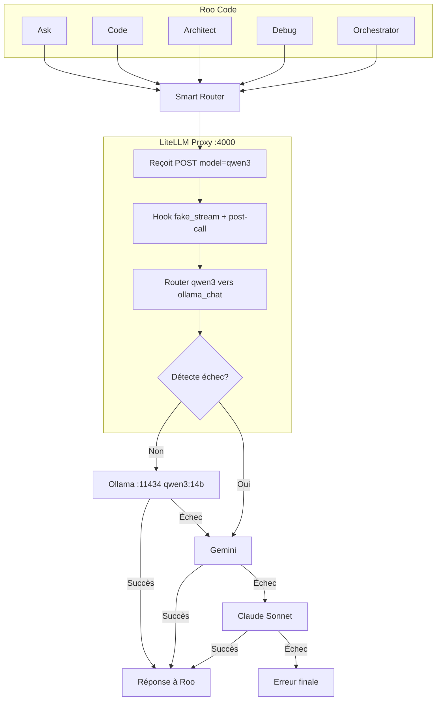

# Plan — Configuration VS Code, Continue.dev et Roo Code

**Objectif** : Configurer VS Code + Continue.dev + Roo Code avec le choix entre :
- **Ollama local** (Calypso) — 0 €, aligné avec le graphe LangGraph
- **Gemini** (free tier) — clé API Google
- **Anthropic Claude Sonnet 4.6** — clé API Anthropic

**Références** : [Phase 7 Implementation](../specs/plans/Implementation_Ecosysteme_Agile_Calypso.md#phase-7--installation-de-lide-cible-vs-code--continuedev--roo-code), [Phase7_Instructions_IDE_Cible](../../docs/Phase7_Instructions_IDE_Cible.md), [HARDWARE_GPU](../../docs/HARDWARE_GPU.md).

**Modèles Ollama** (alignés avec `graph/llm_factory.py`) :
- Tier 1 (idéation, architecture) : `qwen2.5:14b` (défaut) ou `qwen3:14b` (thinking natif, plus lent)
- Tier 2 (code, sprint backlog) : `qwen2.5-coder:14b`

Voir [Strategie_Modeles_LLM_Thinking_Albert_Agile.md](Strategie_Modeles_LLM_Thinking_Albert_Agile.md) pour les recommandations thinking/CoT.

---

## Modes d'utilisation : manuel vs routage automatique

Deux modes sont proposés, à l'instar de Cursor Pro (Smart / manuel) :

### Mode manuel — choix explicite

Tu sélectionnes directement le modèle dans Continue ou Roo Code à chaque requête.

| Avantage | Usage typique |
|----------|---------------|
| Contrôle total, débogage, coût maîtrisé | Tester un modèle précis, comparer les réponses, forcer le local ou le cloud |
| Aucune dépendance à un proxy | Configuration simple (section 3 et 4) |

**Activation** : utiliser la config Continue / Roo Code classique (sections 3 et 4) et choisir le modèle dans la liste.

### Mode automatique — routage comme albert-agile

Un proxy (ex. LiteLLM) route les requêtes selon la tâche et applique une cascade en cas d'échec.

| Étape | Comportement |
|-------|--------------|
| 1. Routage par tâche | Code → coder (qwen2.5-coder), idéation → qwen2.5 ou qwen3, raisonnement complexe → qwen3 (thinking) |
| 2. Cascade | Local (Ollama) → Gemini (gratuit) → Claude Sonnet voire Opus si besoin |

**Activation** : configurer Continue / Roo Code pour pointer vers le proxy LiteLLM (base_url du provider OpenAI) et sélectionner le modèle virtuel (ex. `auto-router` ou `smart-router`). Voir [section 10](#10-optionnel--routage-automatique-via-litellm).

---

## 1. Prérequis

| Élément | Vérification |
|---------|--------------|
| Ollama actif sur Calypso | `ollama list` — `qwen2.5:14b`, `qwen2.5-coder:14b`, `nomic-embed-text` présents (option : `qwen3:14b`) |
| Modèles pull | `ollama pull qwen2.5:14b`, `ollama pull qwen2.5-coder:14b` ; si thinking : `ollama pull qwen3:14b` |
| Connexion SSH à Calypso | `ssh nghia-phan@calypso` fonctionnel |
| VS Code installé sur le PC | https://code.visualstudio.com/ |

---

## 2. VS Code — Installation et Remote-SSH

### 2.1 Installer VS Code

1. Télécharger la version stable : https://code.visualstudio.com/
2. Installer (Windows, Linux ou macOS selon ton OS)
3. Lancer VS Code

### 2.2 Extension Remote-SSH

1. **Extensions** (Ctrl+Shift+X / Cmd+Shift+X)
2. Rechercher **Remote - SSH** (éditeur : Microsoft)
3. Installer

### 2.3 Connexion à Calypso

1. **Ctrl+Shift+P** (ou Cmd+Shift+P) → **Remote-SSH: Connect to Host**
2. Sélectionner ou ajouter `nghia-phan@calypso` (ou ton hôte SSH configuré)
3. VS Code ouvre une nouvelle fenêtre connectée à Calypso
4. Le **terminal intégré à VS Code** (panneau Terminal, Ctrl+`) exécute les commandes **sur Calypso** (contexte Remote-SSH). Ce n'est pas un terminal externe (ex. SSH dans une autre fenêtre).

### 2.4 Convention terminal pour la suite

Toutes les commandes décrites dans ce plan (vérifications, `ollama list`, éventuellement LiteLLM, etc.) sont à exécuter dans le **terminal intégré à VS Code**. Pour l'exécution du graphe Agile (`run_graph.py`, `handle_interrupt.py`, `status.py`), voir [Modes_Bootstrap_et_Runtime_Cible.md](Modes_Bootstrap_et_Runtime_Cible.md) (ou [Plan_Reste_Calypso_E2E_Optionnels.md](Plan_Reste_Calypso_E2E_Optionnels.md)).

**Important — où Continue lit sa config** : Continue v1.x est une extension **locale** (UI extension). Même connecté à Calypso via Remote-SSH, Continue lit sa config depuis le **PC client** (pas depuis Calypso) :
- Windows → `C:\Users\<user>\.continue\config.yaml`
- macOS/Linux client → `~/.continue/config.yaml` sur ce client

Le fichier `~/.continue/config.yaml` sur Calypso n’est **pas lu** dans ce setup (Calypso headless). Les appels aux modèles Ollama transitent malgré tout par le composant distant, donc `http://localhost:11434` dans la config = port 11434 sur Calypso.

---

## 3. Continue.dev — Configuration multi-providers

### 3.1 Installer l’extension

1. Une fois connecté à Calypso : **Extensions** → rechercher **Continue** (continue.dev)
2. Installer

### 3.2 Ouvrir la configuration

- **Ctrl+Shift+P** → **Continue: Open Config**
- Ou créer / éditer directement sur le **PC Windows** : `C:\Users\<user>\.continue\config.yaml` (ou `config.json`)

La config de référence est celle sur le disque du PC client. En Remote-SSH, Continue ne lit pas les fichiers sur Calypso.

### 3.3 Configuration : Ollama + Gemini + Anthropic (YAML)

Fichier `C:\Users\<user>\.continue\config.yaml` (sur le PC Windows) — tu peux choisir le modèle à tout moment dans l’interface :

```yaml
name: Calypso (Ollama + Gemini + Anthropic)
version: 1.0.0
schema: v1

models:
  # --- Ollama local (0 €) ---
  - name: qwen2.5-coder:14b (Ollama)
    provider: ollama
    model: qwen2.5-coder:14b
    apiBase: http://localhost:11434

  - name: qwen2.5:14b (Ollama)
    provider: ollama
    model: qwen2.5:14b
    apiBase: http://localhost:11434

  - name: qwen3:14b (Ollama, thinking)
    provider: ollama
    model: qwen3:14b
    apiBase: http://localhost:11434

  # --- Gemini (free tier) — GOOGLE_API_KEY ---
  - name: gemini-2.5-flash (Gemini)
    provider: gemini
    model: gemini-2.5-flash
    apiKey: ${{ secrets.GOOGLE_API_KEY }}

  # --- Anthropic Claude Sonnet 4.6 — ANTHROPIC_API_KEY ---
  - name: claude-sonnet-4-6 (Anthropic)
    provider: anthropic
    model: claude-sonnet-4-6
    apiKey: ${{ secrets.ANTHROPIC_API_KEY }}
```

**Clés API** : à définir dans `C:\Users\<user>\.continue\.env` (sur le PC Windows, lu automatiquement par Continue v1.x) :
```
GOOGLE_API_KEY=ta-clé-google
ANTHROPIC_API_KEY=ta-clé-anthropic
```
Continue résout `${{ secrets.NOM_CLE }}` depuis ce fichier. Les variables d’environnement système (`export`) ne sont **pas** lues par Continue pour les secrets.

### 3.4 Modèle par défaut

Dans Continue, sélectionner le modèle actif selon le contexte :
- **Ollama code** : `qwen2.5-coder:14b` — alignement E4/E5, 0 €
- **Ollama idéation** : `qwen2.5:14b` (rapide) ou `qwen3:14b` (thinking natif, plus lent)
- **Gemini** : free tier, rapide
- **Anthropic** : Claude Sonnet 4.6 pour les tâches plus complexes

---

## 4. Roo Code — Configuration multi-providers

### 4.1 Installer l’extension

1. **Extensions** → rechercher **Roo Code** (RooVeterinaryInc)
2. Installer

### 4.2 Choix du provider (Provider Settings)

Roo Code permet de choisir entre **Ollama**, **Gemini** et **Anthropic** dans les paramètres (icône engrenage). Un seul provider actif à la fois.

**Ollama (local, 0 €)** :
- API Provider : **Ollama**
- Base URL : `http://localhost:11434`
- Model ID : `qwen2.5-coder:14b` (code), `qwen2.5:14b` (idéation) ou `qwen3:14b` (thinking natif)
- Context Window : 32K minimum

**Gemini (free tier)** :
- API Provider : **Google Gemini**
- API Key : depuis [Google AI Studio](https://aistudio.google.com/)
- Model : `gemini-2.5-flash` (ou équivalent free tier)

**Anthropic Claude Sonnet 4.6** :
- API Provider : **Anthropic**
- API Key : depuis [Anthropic Console](https://console.anthropic.com/)
- Model : `claude-sonnet-4-6`

### 4.3 Profils (optionnel)

Roo Code propose des **API Configuration Profiles** : tu peux créer plusieurs profils (ex. « Ollama local », « Gemini », « Claude ») et basculer selon le contexte.

### 4.4 Roo Code + Chroma (RAG partagé)

Pour que Roo Code utilise le même index RAG (Chroma) que les agents LangGraph et `index_rag.py` :

1. **Prérequis** : chroma-mcp installé dans le venv du projet (`pip install chroma-mcp`).
2. **Créer ou éditer** le fichier `.roo/mcp.json` à la racine du projet (ex. `albert-agile/.roo/mcp.json`).

Exemple de configuration :

```json
{
  "mcpServers": {
    "chroma-mcp": {
      "command": ".venv/bin/chroma-mcp",
      "args": [
        "--client-type",
        "persistent",
        "--data-dir",
        "chroma_db"
      ],
      "disabled": false
    }
  }
}
```

- `command` : chemin vers l'exécutable chroma-mcp (relatif au projet ou absolu, ex. `$AGILE_ORCHESTRATION_ROOT/.venv/bin/chroma-mcp`).
- `--data-dir` : répertoire Chroma (ex. `chroma_db` relatif au projet, ou chemin absolu vers `$AGILE_ORCHESTRATION_ROOT/chroma_db`).
- Avec Remote-SSH, Roo Code s'exécute sur Calypso : `chroma_db` doit être le chemin sur Calypso (ex. `/home/nghia-phan/PROJECTS_WITH_ALBERT/albert-agile/chroma_db` si besoin d'un chemin absolu).

3. **Vérifier** : dans Roo Code, les outils MCP (ex. `chroma_query_documents`) doivent apparaître et être utilisables pour interroger la base Chroma.

Voir aussi [section 7](#7-optionnel--rag-partagé-chroma-mcp) pour le contexte commun Continue + Roo Code.

### 4.5 Persistance de la configuration (Remote-SSH) — ce qui a dû être fait

**Problème rencontré** : En Remote-SSH, Roo Code stocke sa configuration dans le `globalState` de VS Code côté serveur (Calypso). À chaque rechargement de fenêtre, le wizard « Choose your provider » réapparaissait, effaçant la config saisie.

**Cause** : Roo Code s'appuie sur `context.globalState` (base de données SQLite interne à VS Code Server). La configuration ne survit pas toujours aux rechargements de fenêtre dans ce contexte, et le wizard s'affiche à nouveau si aucune configuration valide n'est détectée au démarrage.

**Solution appliquée** : utiliser le mécanisme `roo-cline.autoImportSettingsPath` — Roo Code recharge automatiquement un fichier JSON de config à chaque démarrage.

**Étape 1** — Créer le fichier `settings.json` VS Code côté Calypso (si absent) :

```bash
mkdir -p ~/.vscode-server/data/User
cat > ~/.vscode-server/data/User/settings.json << 'EOF'
{
  "roo-cline.autoImportSettingsPath": "/home/nghia-phan/.config/roo-code-settings.json"
}
EOF
```

**Étape 2** — Générer le fichier de config en passant une fois par le wizard, puis exporter :

1. Laisser le wizard s'afficher → sélectionner **"3rd party Provider"** → choisir **Ollama**
2. Renseigner Base URL : `http://localhost:11434` et Model ID : `qwen2.5-coder:14b`
3. Cliquer **Finish**
4. Dans le panneau Roo Code, cliquer l'icône **⚙ (engrenage)** → descendre jusqu'à **Export**
5. Sauvegarder sous `/tmp/roo-export.json` (ou via le terminal) puis :

```bash
cp /tmp/roo-export.json ~/.config/roo-code-settings.json
```

> **Pourquoi exporter plutôt que créer manuellement ?** Un fichier JSON créé à la main avec `"provider": "ollama"` et `"baseUrl": "..."` ne correspond pas exactement au schéma interne de Roo Code (ex. le champ pour Ollama est `ollamaBaseUrl`, pas `baseUrl`). Un fichier invalide ou partiel ne passe pas la validation et déclenche quand même le wizard. L'export garantit le format exact attendu.

**Fichiers créés sur Calypso** :

| Fichier | Rôle |
|---------|------|
| `~/.vscode-server/data/User/settings.json` | Paramètre VS Code activant l'auto-import Roo Code |
| `~/.config/roo-code-settings.json` | Profils Roo Code rechargés à chaque démarrage |
| `.roo/mcp.json` (projet) | Serveur MCP chroma-mcp pour le RAG partagé (section 4.4 et 7) |

**Vérification** : Au redémarrage de VS Code, Roo Code doit afficher la notification `"RooCode settings automatically imported from roo-code-settings.json"` et ne plus afficher le wizard.

### 4.6 Roo Code + modèles locaux — fix boucle infinie (tool calling)

**Problème** : Les modèles locaux (qwen3:14b, hermes3:8b, etc.) appellent parfois `ask_followup_question` sans le paramètre obligatoire `follow_up`. Roo Code valide le schéma, détecte l'erreur, retry → boucle infinie.

**Cause racine** : En streaming, le post-call hook LiteLLM s'exécute *après* envoi des chunks SSE au client — impossible de corriger la réponse à ce stade.

**Solution déployée** (LiteLLM proxy + hooks) :
1. **`fake_stream: true`** sur les modèles Ollama — LiteLLM appelle en non-streaming, reçoit le JSON complet, puis génère des faux chunks SSE.
2. **Post-call hook** (`config/litellm_hooks.py`) — corrige `follow_up` absent ou invalide dans la réponse *avant* génération des chunks SSE.
3. Le client Roo Code reçoit des tool calls valides → pas de retry → pas de boucle.

**Fichiers** : `config/litellm_hooks.py`, `config/litellm_config.yaml` (callbacks + fake_stream). Le proxy LiteLLM doit être lancé (section 10) pour que Roo Code utilise cette config via le profil « Smart Router » (Base URL `http://localhost:4000`).

---

## 5. Vérification

| Étape | Action | Résultat attendu |
|-------|--------|------------------|
| 5.1 | Dans VS Code connecté à Calypso, ouvrir Continue | Chat Continue disponible |
| 5.2 | Continuer avec Ollama sélectionné, poser une question | Réponse générée (pas d’erreur 404/500) |
| 5.3 | Continuer avec Gemini puis Anthropic | Les deux répondent si les clés API sont configurées |
| 5.4 | Ouvrir Roo Code, lancer une tâche | Roo Code répond selon le provider actif |
| 5.5 | (Ollama) Vérifier les logs | Dans le **terminal intégré à VS Code** connecté à Calypso : `ollama ps` montre le modèle chargé lors des requêtes |
| 5.6 | (Chroma) Si chroma-mcp configuré | Dans Roo Code, les outils MCP (ex. chroma_query_documents) apparaissent ; une requête utilisant le contexte RAG renvoie des extraits de chroma_db |

---

## 6. Recommandations (GPU / contention)

Voir [HARDWARE_GPU.md](../../docs/HARDWARE_GPU.md).

- **Pendant E4/E5** (graphe LangGraph actif) : utiliser le **même modèle prioritaire** (`qwen2.5-coder:14b`) dans Continue et Roo Code pour limiter le swapping Ollama.
- **Alternative** : désactiver l’autocomplétion IA pendant E4/E5.
- **Keep-alive** (optionnel) : `export OLLAMA_KEEP_ALIVE=24h` avant de lancer le graphe. Pour précharger le modèle prioritaire : `ollama run qwen2.5-coder:14b "warmup"` (cf. `scripts/test_e2e_manual.py`, `docs/HARDWARE_GPU.md`).

---

## 7. Optionnel — RAG partagé (chroma-mcp)

Pour que **Continue** et **Roo Code** utilisent le même index RAG que les agents LangGraph :

1. Installer chroma-mcp : `pip install chroma-mcp` (dans le venv du projet)
2. **Continue** : configurer chroma-mcp dans `config.yaml` (mcpServers) sur le PC Windows, pointer vers `$AGILE_ORCHESTRATION_ROOT/chroma_db` (via chemin accessible en Remote-SSH)
3. **Roo Code** : configurer chroma-mcp dans `.roo/mcp.json` — voir la [section 4.4](#44-roo-code--chroma-rag-partagé) pour les étapes détaillées.
4. Référer à la doc [Continue MCP](https://docs.continue.dev/customize/mcp-tools) et [Roo Code MCP](https://docs.roocode.com/features/mcp/overview).

---

## 8. Résumé — Choix de provider

| Provider | Coût | Clé API | Modèles recommandés |
|----------|------|---------|---------------------|
| **Ollama** | 0 € | — | `qwen2.5-coder:14b`, `qwen2.5:14b`, `qwen3:14b` (thinking) |
| **Gemini** | Free tier | `GOOGLE_API_KEY` | `gemini-2.5-flash` |
| **Anthropic** | Pay-as-you-go | `ANTHROPIC_API_KEY` | `claude-sonnet-4-6` |

Continue : tous les modèles sont listés dans la config ; tu choisis celui à utiliser à la volée.  
Roo Code : un seul provider actif ; tu peux définir plusieurs profils pour basculer.

---

## 9. URLs et chemins

| Composant | URL / Chemin |
|-----------|--------------|
| Ollama API | `http://localhost:11434` (Calypso = localhost en Remote-SSH) |
| Config Continue | `C:\Users\<user>\.continue\config.yaml` (PC Windows) |
| Secrets Continue | `C:\Users\<user>\.continue\.env` (PC Windows) |
| Config Roo Code | `~/.config/roo-code-settings.json` (Calypso) — référence : `config/reference/roo-code-settings.json` |
| Configs référence (sync) | `config/reference/` — Roo + Continue, voir `config/reference/README.md` et `scripts/sync_ide_configs.sh` |
| Roo MCP (Chroma) | `$PROJECT_ROOT/.roo/mcp.json` (ex. `albert-agile/.roo/mcp.json`) |
| Chroma (optionnel) | `$AGILE_ORCHESTRATION_ROOT/chroma_db` (Continue + Roo Code via MCP chroma-mcp) |
| LiteLLM Proxy (optionnel) | `http://localhost:4000` — config : `config/litellm_config.yaml`, script : `scripts/run_litellm_proxy.sh`, service boot : `config/litellm-proxy.service` |

---

## 10. Optionnel — routage automatique via LiteLLM

Pour le **mode automatique** (routage par tâche + cascade), installer et configurer LiteLLM Proxy :

### 10.1 Installation

```bash
pip install 'litellm[proxy]'
```

### 10.2 Configuration

Le fichier `config/litellm_config.yaml` est créé avec une cascade Ollama → Gemini → Claude.

> **⚠️ Limitation LiteLLM (v1.82+) — complexity_router non supporté via le serveur HTTP**
>
> Le `complexity_router` (`auto_router/complexity_router`) fonctionne uniquement via le SDK Python LiteLLM (usage en code).  
> Via le serveur proxy HTTP, LiteLLM lève `LiteLLMUnknownProvider: Unmapped LLM provider, custom_llm_provider=auto_router`.  
> **Workaround** : les IDEs (Continue, Roo Code) envoient un modèle direct (`qwen2.5-coder`) et bénéficient de la cascade de fallbacks automatique configurée dans `litellm_settings.fallbacks`.

**Clés API** : `GOOGLE_API_KEY` et `ANTHROPIC_API_KEY` — à définir dans `.env` à la racine du projet ou dans l'environnement. LiteLLM les charge via `os.environ/GOOGLE_API_KEY` et `os.environ/ANTHROPIC_API_KEY`.

### 10.3 Lancer le proxy

*Dans le **terminal intégré à VS Code** (connecté à Calypso, depuis la racine du projet) :*

```bash
# Activer le venv, charger .env, lancer le proxy
source .venv/bin/activate
[ -f .env ] && set -a && source .env && set +a
litellm --config config/litellm_config.yaml --port 4000
```

Ou via le script :

```bash
./scripts/run_litellm_proxy.sh
# ou sur un port différent : ./scripts/run_litellm_proxy.sh 4001
```

Le proxy écoute sur `http://0.0.0.0:4000`. En Remote-SSH, `localhost:4000` = Calypso.

### 10.3bis Démarrage au boot (Calypso)

Pour que LiteLLM soit disponible sans le lancer manuellement, créer un service systemd utilisateur :

```bash
# Sur Calypso, dans le terminal (ou Remote-SSH)
mkdir -p ~/.config/systemd/user
cp $AGILE_ORCHESTRATION_ROOT/config/litellm-proxy.service ~/.config/systemd/user/

# Adapter le chemin si le projet n'est pas dans ~/PROJECTS_WITH_ALBERT/albert-agile
# (éditer WorkingDirectory, EnvironmentFile, ExecStart)

systemctl --user daemon-reload
systemctl --user enable litellm-proxy
systemctl --user start litellm-proxy

# Vérifier : systemctl --user status litellm-proxy
```

Le service démarre au login de l'utilisateur. Pour un démarrage au boot machine (avant login), utiliser un service système (`/etc/systemd/system/`) avec `User=nghia-phan`.

### 10.4 Configurer Continue et Roo Code pour le mode automatique

| Étape | Continue | Roo Code |
|-------|----------|----------|
| 1 | Ouvrir `C:\Users\<user>\.continue\config.yaml` (PC Windows) | Paramètres Roo Code (engrenage) → API Configuration Profiles |
| 2 | Ajouter le modèle ci-dessous dans `models:` | Profil « Smart Router » déjà créé dans `~/.config/roo-code-settings.json` |
| 3 | Sélectionner « Smart Router (auto) » dans l'interface | Provider : **OpenAI** |
| 4 | | Base URL : `http://localhost:4000` |
| 5 | | **Model ID : `qwen3`** — tous les modes utilisent Smart Router (voir tableau ci-dessous) |
| 6 | | API Key : `sk-1234` (ou vide) |

**Extrait à ajouter dans `config.yaml` Continue** :

```yaml
  - title: Smart Router (auto)
    provider: openai
    model: qwen3   # ou qwen2.5-coder, gemini selon usage
    apiBase: http://localhost:4000
    apiKey: "sk-1234"   # valeur factice si LiteLLM sans master_key
```

**Routage par mode Roo Code** — tous les modes pointent vers Smart Router (local prioritaire) :

| Mode Roo | Profil | POST |
|----------|--------|------|
| Ask | Smart Router | `POST http://localhost:4000/v1/chat/completions` (model=qwen3) |
| Code | Smart Router | `POST http://localhost:4000/v1/chat/completions` (model=qwen3) |
| Architect | Smart Router | `POST http://localhost:4000/v1/chat/completions` (model=qwen3) |
| Debug | Smart Router | `POST http://localhost:4000/v1/chat/completions` (model=qwen3) |
| Orchestrator | Smart Router | `POST http://localhost:4000/v1/chat/completions` (model=qwen3) |

**Résumé détaillé des chemins** :

| Étape | Composant | Modes | Profil | POST / URL | Rôle |
|-------|-----------|-------|--------|------------|------|
| 1 | Roo Code | Ask, Code, Architect, Debug, Orchestrator | Smart Router | `POST http://localhost:4000/v1/chat/completions` (model=qwen3) | Envoie les requêtes |
| 2 | LiteLLM proxy | — | — | `http://localhost:4000` | Reçoit, applique hook (fake_stream + post-call), **détecte échec et lance fallbacks** |
| 3 | LiteLLM router | — | — | `model_name: qwen3` → `ollama_chat/qwen3:14b` | Résout l'alias, sélectionne le modèle |
| 4 | Ollama | — | — | `http://localhost:11434/api/chat` | Exécute qwen3:14b |
| 5 | Fallback 1 | — | — | `gemini/gemini-2.5-flash` | Si Ollama échoue |
| 6 | Fallback 2 | — | — | `anthropic/claude-sonnet-4-6` | Si Gemini échoue |

**Schéma Mermaid** :



**Comportement** : Avec `fake_stream: true` + post-call hook (section 4.6), qwen3 local fonctionne sans boucle infinie sur les tool calls. LiteLLM déclenche les fallbacks si Ollama ou Gemini échouent.

> **⚠️ Tests en attente** : Les tests de tous les chemins (tous les modes Roo + fallbacks) doivent encore être validés.
