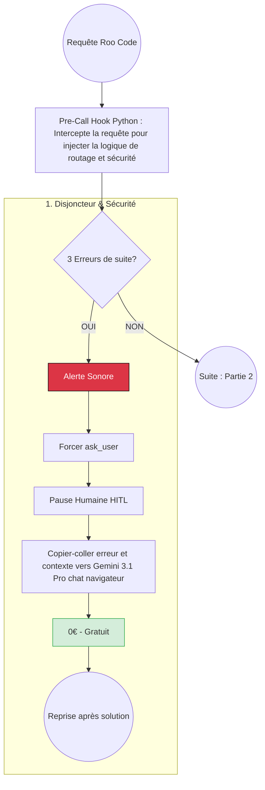
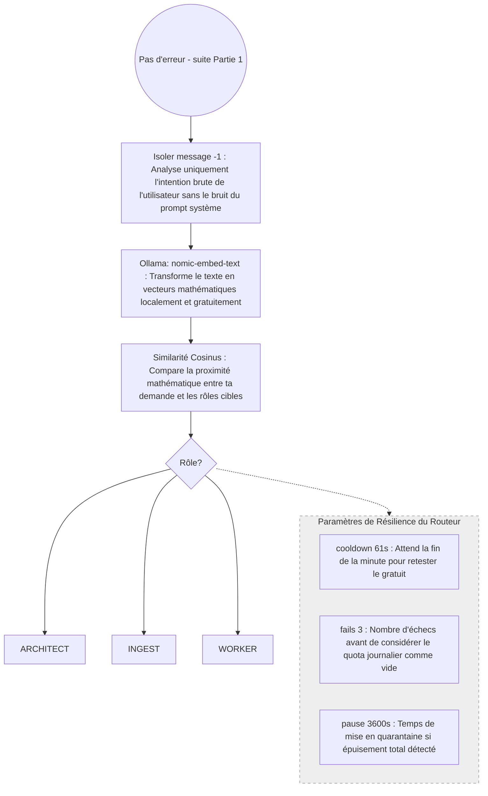
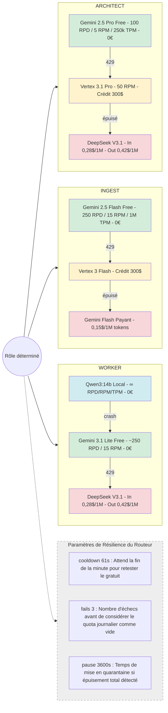

# Stratégie de routage intelligent — Proposition Gemini 3.1 Pro

**Source** : Synthèses proposées par Gemini 3.1 Pro (chat navigateur, gratuit) pour optimiser l'utilisation des ressources (RTX 5060, modèles locaux, APIs cloud). Inclut : cascade « Coût Zéro » (Free → Vertex → Local), Cerveau Sémantique (routage par embeddings), HITL anti-boucle.

**Contexte actuel albert-agile** : RTX 5060 Ti 16G, qwen3:14b local via Ollama, fallback Gemini 2.5 Flash puis Claude Sonnet. Voir [Plan_Configuration_VSCode_Ollama_Local.md](Plan_Configuration_VSCode_Ollama_Local.md).

> ⚠️ **Note d'adaptation** : Les noms de modèles proposés (Gemini 3 Flash, DeepSeek-V3.1, Claude 4.6) peuvent différer des offres actuelles. Adapter selon disponibilité : ex. `gemini-2.5-flash` à la place de `gemini-3-flash`, `claude-sonnet-4` au lieu de `claude-4-6-sonnet`, etc.

---

## 1. La stratégie globale : routage intelligent et optimisation des coûts

L'objectif est d'orchestrer un agent autonome (Roo Code) de manière extrêmement rentable, en déléguant dynamiquement les requêtes au modèle le plus adapté selon la tâche, tout en empêchant l'agent de tourner en boucle et de consommer inutilement des ressources.

La répartition des rôles s'articule autour de trois axes :

1. **L'ingestion massive (`ingest`)** : Le traitement de gigantesques documentations ou *repositories* est confié à Gemini 3 Flash, offrant une fenêtre de contexte massive à un coût dérisoire.
2. **La conception de haut niveau (`architect`)** : L'architecture système et les plans de tests complexes sont envoyés à DeepSeek-V3.1, qui offre le meilleur ratio prix/raisonnement du marché. En cas de défaillance de l'API, le système bascule automatiquement sur Claude 4.6 Sonnet pour garantir la continuité du service.
3. **Le travail de terrain (`worker`)** : Le codage, le refactoring, les validations Git et le débogage itératif sont interceptés et envoyés gratuitement vers le modèle local (Qwen3:14b tournant sur la machine).

---

### 1.1 La logique de cascade « Coût Zéro » (Mars 2026)

Le système suit une hiérarchie stricte pour chaque requête envoyée par Roo Code :

1. **Priorité Alpha (Gratuit total)** : Google AI Studio Free Tier — limites (ex. 100 requêtes/jour Pro, 250 Flash). Modèles : `gemini-2.5-pro`, `gemini-2.5-flash`.
2. **Priorité Beta (Crédit payant)** : Si quota gratuit atteint (Error 429), bascule sur Vertex AI (ex. compte avec crédit 300 $). Modèles : `vertex_ai/gemini-3.1-pro-001`, `vertex_ai/gemini-3-flash`.
3. **Priorité Gamma (Sécurité locale)** : Tâches de routine → Qwen3 local via Ollama, à volonté et sans frais.
4. **Réévaluation flash** : Paramètre `model_cooldown_time: 61` — le système retente les modèles gratuits toutes les 61 secondes pour repasser sur le gratuit dès qu'un nouveau quota minute est disponible.
5. **Fallbacks Worker (Low-Cost)** : Si Qwen3 local crash ou timeout → Gemini 3.1 Lite (Free). Si quota 429 → DeepSeek V3.1 (payant).
6. **Fallback Ingest payant** : Si Vertex épuisé → Gemini 2.5 Flash avec clé payante (~0,15 $/1M tokens).

#### Glossaire des limites

| Acronyme | Signification | Description |
|----------|---------------|-------------|
| **RPD** | Requests Per Day | Nombre maximal de requêtes par jour (quota quotidien). Dépassé → erreur 429. |
| **RPM** | Requests Per Minute | Nombre maximal de requêtes par minute. Dépassé → erreur 429, réessai après cooldown. |
| **TPM** | Tokens Per Minute | Nombre maximal de tokens (input + output) traités par minute. Dépassé → erreur 429. |
| **300 $** | Crédit Vertex AI | Montant du crédit offert par Google sur le compte Vertex (ex. fille). Consommé au fur et à mesure des appels payants. |
| **model_cooldown_time** | Réévaluation (s) | Délai en secondes avant de retenter un modèle en erreur 429. Ex. 61 s → réessai après 1 min pour reprendre le quota. |
| **allowed_fails** | Échecs tolérés | Nombre d'échecs consécutifs avant de passer au modèle suivant dans la cascade. |
| **cooldown_time** | Pause (s) | Délai en secondes avant de réactiver un modèle après trop d'échecs. Ex. 3600 → 1 h. |
| **dyn.** | Dynamique | DeepSeek : pas de quota RPD/RPM/TPM fixe publié, ajusté selon charge et usage. |

#### Tableau des limites par palier (Mars 2026 — à vérifier selon offres Google)

| Rôle | Paliers | Modèle | RPD | RPM | TPM | Crédit / Coût |
|------|---------|--------|-----|-----|-----|---------------|
| **architect** | 1. Free | `gemini-2.5-pro` (AI Studio) | 100 | 5 | 250 000 | 0 € |
| | 2. Vertex | `vertex_ai/gemini-3.1-pro-001` | — | 50 | — | Crédit 300 $ |
| | 3. Payant | `deepseek-chat-v3.1` | dyn. | dyn. | dyn. | Input 0,28 $/1M, Output 0,42 $/1M |
| **ingest** | 1. Free | `gemini-2.5-flash` (AI Studio) | 250 | 15 | 1 000 000 | 0 € |
| | 2. Vertex | `vertex_ai/gemini-3-flash` | — | — | — | Crédit 300 $ |
| | 3. Payant | `gemini-2.5-flash` (clé payante) | — | — | — | ~0,15 $/1M tokens |
| **worker** | 1. Local | `ollama/qwen3:14b` | ∞ | ∞ | ∞ | 0 € |
| | 2. Free | `gemini-3.1-flash-lite` (AI Studio) | ~250 | 15 | — | 0 € |
| | 3. Payant | `deepseek-chat-v3.1` | dyn. | dyn. | dyn. | Input 0,28 $/1M, Output 0,42 $/1M |

> ⚠️ **Source** : Google AI Studio / Vertex AI : [aistudio.google.com](https://aistudio.google.com/), [Vertex AI Pricing](https://cloud.google.com/vertex-ai/pricing). DeepSeek : [api-docs.deepseek.com](https://api-docs.deepseek.com/quick_start/pricing/) — RPM/TPM dynamiques (pas de quota fixe publié), Input cache miss 0,28 $/1M, Output 0,42 $/1M.

---

### 1.2 Schéma Mermaid — logique complète

> **Note** : Le diagramme est scindé en deux pour éviter le découpage dans la preview Markdown (le sous-graphe « Cascade de Coûts » est trop haut pour les conteneurs par défaut).

**Flux principal — Partie 1 : Disjoncteur & Sécurité (HITL)**



**Flux principal — Partie 2 : Routage sémantique**



**Cascade de Coûts Mars 2026 (détails par rôle + limites RPD/RPM/TPM/300$)**



**Vue d'ensemble consolidée (flux + cascade + paramètres routeur)**


---

## 2. La défense en profondeur : sécurité anti-boucle (HITL)

Pour pallier le risque d'entêtement typique des agents autonomes face à un bug persistant, une double protection "Human-in-the-Loop" est instaurée :

- **Niveau 1 (Front-end)** : Des consignes strictes sont données à Roo Code pour qu'il s'interrompe lui-même après trois échecs et utilise son canal officiel pour demander l'assistance humaine.
- **Niveau 2 (Back-end)** : Un disjoncteur silencieux est intégré au routeur (LiteLLM). Il compte les erreurs dans l'historique récent. S'il détecte une boucle que l'agent n'a pas su arrêter, il coupe l'accès au modèle, déclenche une alerte sonore sur le terminal et force la mise en pause.

---

## 3. L'intervention humaine manuelle (HITL) via Gemini 3.1 Pro

Le "Human-in-the-loop" via le chat du navigateur avec Gemini 3.1 Pro permet de faire chuter drastiquement les coûts d'API tout en garantissant une qualité maximale.

1. **L'élaboration de l'Architecture (Zero-to-One)** : Au lieu de consommer des centaines de milliers de tokens API pour les tâtonnements conceptuels, l'itération se fait dans le chat. Le document de spécifications généré est ensuite copié dans un fichier `architecture_blueprint.md` et transmis à Roo Code pour que le modèle local crée le squelette gratuitement.
2. **L'assistance au débogage complexe** : Si le modèle local Qwen se retrouve bloqué sur une erreur tenace, Roo Code est mis en pause. Le fichier problématique et le log d'erreur sont copiés dans le chat Gemini pour une analyse experte, puis la solution précise est transmise à l'agent local.
3. **La génération des Plans de Tests et de la Documentation** : Pour éviter les coûts d'output élevés des API, le code brut est fourni à Gemini dans le navigateur qui se charge de rédiger les documents longs (`plan_de_test.md`). L'exécution répétitive (écrire et passer les tests) est ensuite déléguée au travailleur local.

---

## 4. Les mécanismes de transfert de contexte

Pour faciliter les allers-retours (copier-coller) entre l'IDE et le navigateur sans friction, trois méthodes sont possibles :

1. **L'export natif de Roo Code (Le plus rapide)** : L'interface de chat de Roo Code possède une icône de copie ou un menu d'export permettant de récupérer en un clic la dernière réponse, le log d'erreur complet ou l'historique récent proprement formaté en Markdown.
2. **Les extensions VS Code "AI Context Copier" (Le plus structuré)** : Des extensions gratuites comme "ChatGPT - Copy to Clipboard" ou "AI Context" permettent de sélectionner plusieurs fichiers dans l'explorateur et de les copier dans le presse-papier avec une structure Markdown parfaite (incluant le nom du fichier et le bloc de code associé).
3. **Le script local Python (L'approche sur-mesure)** : Un petit utilitaire en ligne de commande (utilisant la librairie `pyperclip`) qui lit les fichiers ciblés, récupère automatiquement les derniers logs d'erreurs du projet, formate le tout avec des instructions claires et l'envoie directement dans le presse-papier.

---

## 5. Fichiers de configuration (mot pour mot)

### 5.1 Fichier de configuration principal LiteLLM (`config/litellm_config.yaml`)

Ce fichier déclare les trois rôles, configure les modèles associés, gère le *fallback* automatique pour l'architecte, et active le script d'interception Python.

```yaml
model_list:
  # 1. L'Architecte Cloud (DeepSeek en priorité, Claude en roue de secours)
  - model_name: architect
    litellm_params:
      model: deepseek/deepseek-chat-v3.1
      fallbacks:
        - anthropic/claude-4-6-sonnet-20260219

  # 2. L'ingestion massive de contexte documentaire
  - model_name: ingest
    litellm_params:
      model: gemini/gemini-3-flash

  # 3. Le travailleur local gratuit (Code, Debug, Git)
  - model_name: worker
    litellm_params:
      model: ollama/qwen3:14b
      api_base: http://localhost:11434

litellm_settings:
  # Appel de ton script Python pour l'interception et le routage
  custom_callbacks:
    - custom_roo_hook.proxy_handler_instance
```

> **Note** : Dans LiteLLM récent, le champ est `callbacks` (et non `custom_callbacks`), et le chemin doit correspondre à un module importable (ex. `config.custom_roo_hook.proxy_handler_instance` si le fichier est dans `config/`).

#### 5.1b Variante cascade « Coût Zéro » avec Vertex AI et fallbacks Low-Cost (Mars 2026)

Configuration complète avec paliers Free → Vertex → Payant, incluant les fallbacks Worker (crash/timeout → Gemini Lite, quota → DeepSeek) et Ingest (Vertex épuisé → Gemini Flash payant).

```yaml
model_list:
  # --- ARCHITECT (Gemini Free → Vertex → DeepSeek) ---
  - model_name: architect
    litellm_params:
      model: gemini/gemini-2.5-pro
      api_key: "os.environ/GEMINI_FREE_KEY"
      rpm: 5
      tpm: 250000

  - model_name: architect
    litellm_params:
      model: vertex_ai/gemini-3.1-pro-001
      vertex_project: "os.environ/VERTEX_PROJECT"

  - model_name: architect
    litellm_params:
      model: deepseek/deepseek-chat-v3.1

  # --- INGEST (Gemini Free → Vertex → Gemini Payant) ---
  - model_name: ingest
    litellm_params:
      model: gemini/gemini-2.5-flash
      api_key: "os.environ/GEMINI_FREE_KEY"
      rpm: 15

  - model_name: ingest
    litellm_params:
      model: vertex_ai/gemini-3-flash
      vertex_project: "os.environ/VERTEX_PROJECT"

  - model_name: ingest
    litellm_params:
      model: gemini/gemini-2.5-flash
      api_key: "os.environ/GEMINI_PAYANT_KEY"

  # --- WORKER (Local → Gemini Lite Free → DeepSeek) ---
  - model_name: worker
    litellm_params:
      model: ollama/qwen3:14b
      api_base: "http://localhost:11434"

  - model_name: worker
    litellm_params:
      model: gemini/gemini-3.1-flash-lite
      api_key: "os.environ/GEMINI_FREE_KEY"

  - model_name: worker
    litellm_params:
      model: deepseek/deepseek-chat-v3.1
      api_key: "os.environ/DEEPSEEK_API_KEY"

router_settings:
  routing_strategy: priority-based
  enable_fallbacks: true
  model_cooldown_time: 61
  allowed_fails: 3
  cooldown_time: 3600

litellm_settings:
  cache_responses: true
  usage_tracking: true
  callbacks:
    - config.custom_roo_hook.proxy_handler_instance
```

> **Note** : `router_settings` et `model_cooldown_time` peuvent dépendre de la version LiteLLM. Vérifier la doc officielle.

---

### 5.2 Le Cerveau Sémantique — routage par embeddings (`config/custom_roo_hook.py`)

Implémentation complète du routage sémantique : embeddings locaux (nomic-embed-text via Ollama), similarité cosinus, vecteurs de référence pré-calculés. Zéro lissage car seul `messages[-1]` est vectorisé.

**Prérequis** : `ollama pull nomic-embed-text`, `pip install numpy ollama python-dotenv`

```python
import numpy as np
import ollama
import os
from litellm.integrations.custom_logger import CustomLogger
from dotenv import load_dotenv

load_dotenv()

def cosine_similarity(a, b):
    return np.dot(a, b) / (np.linalg.norm(a) * np.linalg.norm(b))

class RooCodeHandler(CustomLogger):
    def __init__(self):
        self.categories = {
            "architect": "System design, software architecture, test strategy, high-level planning, database schema",
            "ingest": "Scan whole repository, read all documentation files, analyze huge context, deep code search",
            "worker": "Fix bugs, refactor code, write functions, terminal commands, git operations, unit tests"
        }
        self.category_vectors = {
            name: np.array(ollama.embed(model='nomic-embed-text', input=text)['embeddings'][0])
            for name, text in self.categories.items()
        }

    async def async_pre_call_hook(self, user_api_key_dict, cache, data, call_type):
        messages = data.get("messages", [])
        if not messages or call_type != "completion":
            return data

        # --- SÉCURITÉ ANTI-BOUCLE ---
        last_5_content = [str(m.get("content", "")).lower() for m in messages[-5:]]
        error_count = sum(1 for msg in last_5_content if any(err in msg for err in ["error", "failed"]))

        if error_count >= 3:
            print("\a🚨 [HITL] BOUCLE D'ERREUR DÉTECTÉE")
            data["messages"] = [{"role": "user", "content": "STOP: Error loop. Use 'ask_user'."}]
            data["model"] = "worker"
            return data

        # --- ROUTAGE SÉMANTIQUE (message -1 uniquement) ---
        user_intent = str(messages[-1].get("content", ""))
        intent_vector = np.array(ollama.embed(model='nomic-embed-text', input=user_intent)['embeddings'][0])

        scores = {name: cosine_similarity(intent_vector, vec) for name, vec in self.category_vectors.items()}
        best_category = max(scores, key=scores.get)

        print(f"--- [ROUTAGE] : {best_category.upper()} (Score: {scores[best_category]:.2f}) ---")
        data["model"] = best_category
        return data

proxy_handler_instance = RooCodeHandler()
```

---

### 5.3 Fichier d'environnement (`.env`)

```env
GEMINI_FREE_KEY="ton_api_key_gratuite"
GEMINI_PAYANT_KEY="ton_api_key_payante"
VERTEX_PROJECT="project-id-fille"
DEEPSEEK_API_KEY="ta_cle_deepseek"
```

---

### 5.4 Pourquoi le routage sémantique (limite des mots-clés)

**Source** : Suggestion d'adaptation par Gemini 3.1 Pro.

Avec des mots-clés simples (`"structurer le projet" in text`), la phrase « Je vais structurer le projet » est routée correctement. Mais « Je vais concevoir le squelette de l'application » rate le mot-clé et envoie une tâche d'architecture au petit modèle local.

Le **Cerveau Sémantique** (section 5.2) résout ce problème : l'embedding comprend par lui-même que « squelette », « blueprint » ou « fondations » relèvent de l'alias `architect`, sans liste de synonymes à maintenir. *Zéro lissage* car seule la dernière phrase est vectorisée.

---

### 5.5 Instructions personnalisées pour l'agent (Roo Code Custom Instructions)

Ce bloc de texte, placé dans les paramètres de l'extension Roo Code, constitue la première ligne de défense. Il empêche le modèle local de multiplier les tentatives ratées et formalise sa demande d'aide.

```text
# CRITICAL RULE: HUMAN-IN-THE-LOOP (HITL) TRIGGER
You are operating in a resource-optimized environment. If you encounter the same error, a failing test, or a command failure 3 times in a row while attempting to fix it, YOU MUST STOP IMMEDIATELY. Do not attempt a 4th fix. Do not hallucinate workarounds.

Instead, you must strictly use the 'ask_user' tool to request human intervention.
Your message to the user must start exactly with: "🚨 HITL REQUIRED: I am stuck in an error loop."
Include a brief, bulleted summary of:
1. The exact error message.
2. The 3 attempted solutions that failed.
Wait for the user's explicit instructions before proceeding with any other tool.
```

---

## 6. Synthèse et cartographie avec la config actuelle

| Proposition Gemini | Config actuelle albert-agile | Statut |
|--------------------|------------------------------|--------|
| Cascade « Coût Zéro » + fallbacks Low-Cost | Cascade qwen3 → gemini → claude, pas de paliers Free/Vertex/Worker fallbacks | Voir section 5.1b |
| Schéma Mermaid (flux complet) | Non documenté | Section 1.2 |
| Routage sémantique (Cerveau Sémantique) | Mots-clés simples ; nomic-embed-text dispo pour RAG | Code complet section 5.2 |
| Fallbacks Worker (crash → Gemini Lite, quota → DeepSeek) | Non implémenté | Voir section 5.1b |
| Fallback Ingest payant (Gemini 2.5 Flash $) | Non implémenté | Voir section 5.1b |
| Fichier .env (clés Free, Payant, Vertex, DeepSeek) | .env existant sans VERTEX_PROJECT, GEMINI_PAYANT_KEY | Voir section 5.3 |

Voir [Plan_Configuration_VSCode_Ollama_Local.md](Plan_Configuration_VSCode_Ollama_Local.md) pour la configuration déployée et [Strategie_Modeles_LLM_Thinking_Albert_Agile.md](Strategie_Modeles_LLM_Thinking_Albert_Agile.md) pour la stratégie thinking/CoT.
