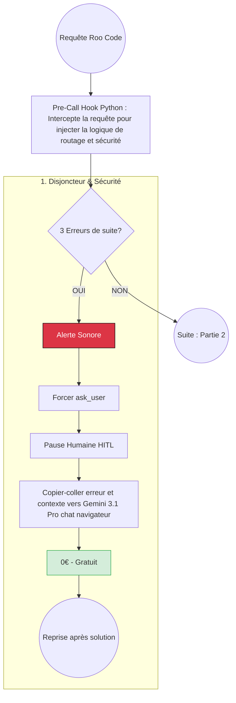
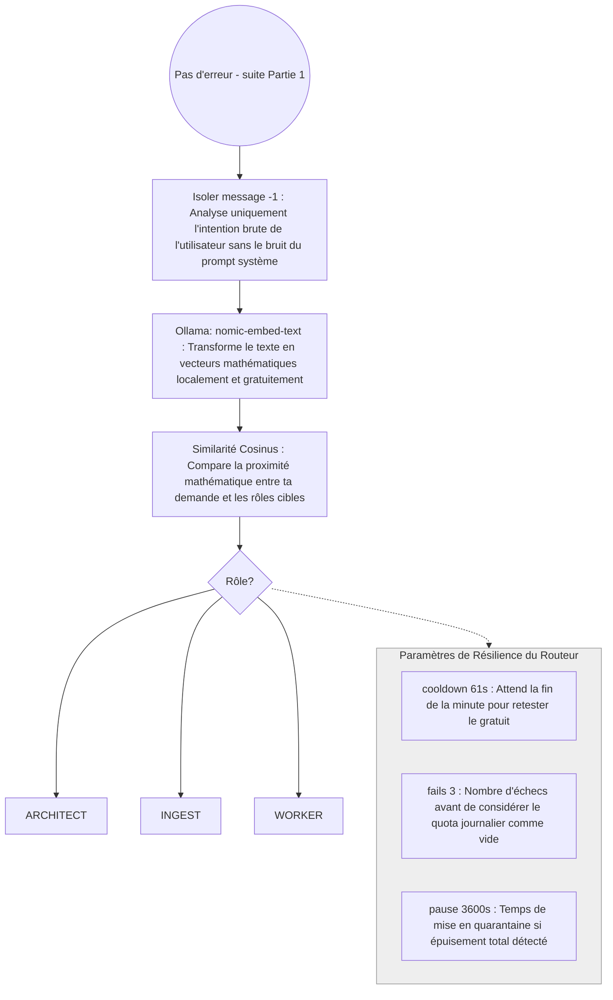
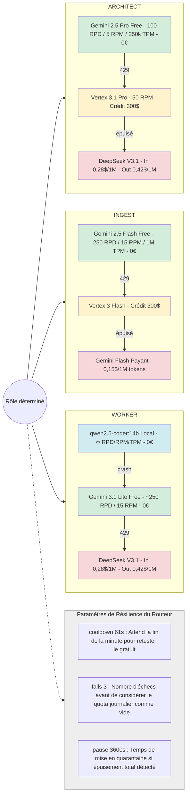
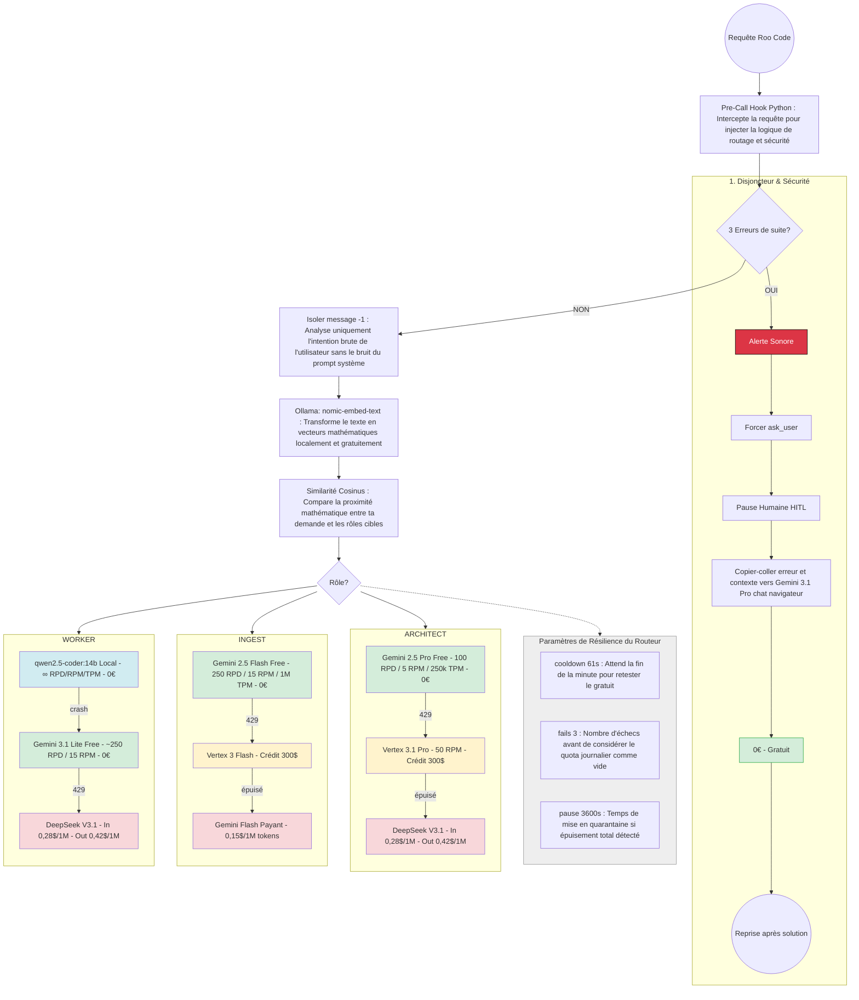

# Stratégie de routage intelligent — Proposition Gemini 3.1 Pro

**Source** : Synthèses proposées par Gemini 3.1 Pro (chat navigateur, gratuit) pour optimiser l'utilisation des ressources (RTX 5060, modèles locaux, APIs cloud). Inclut : cascade « Coût Zéro » (Free → Vertex → Local), Cerveau Sémantique (routage par embeddings), HITL anti-boucle, caractéristiques des modèles locaux (structured, thinking, tools), fiabilisation Roo + LLMs locaux (fake_stream + post-call). Annexe (section 8) : synthèse complète construction des prompts Roo / LangGraph et fonctionnement du RAG. Section 9 : SearXNG — accès web temps réel pour les agents. Section 10 : Sécurité & Extensions (Microsoft Presidio, nomenclature technique).

**Contexte actuel albert-agile** : RTX 5060 Ti 16G, qwen3:14b local via Ollama, fallback Gemini 2.5 Flash puis Claude Sonnet. Voir [Plan_Configuration_VSCode_Ollama_Local.md](Plan_Configuration_VSCode_Ollama_Local.md).

> ⚠️ **Note d'adaptation** : Les noms de modèles proposés (Gemini 3 Flash, DeepSeek-V3.1, Claude 4.6) peuvent différer des offres actuelles. Adapter selon disponibilité : ex. `gemini-2.5-flash` à la place de `gemini-3-flash`, `claude-sonnet-4` au lieu de `claude-4-6-sonnet`, etc.

---

## 1. La stratégie globale : routage intelligent et optimisation des coûts

L'objectif est d'orchestrer un agent autonome (Roo Code) de manière extrêmement rentable, en déléguant dynamiquement les requêtes au modèle le plus adapté selon la tâche, tout en empêchant l'agent de tourner en boucle et de consommer inutilement des ressources.

La répartition des rôles s'articule autour de trois axes :

1. **L'ingestion massive (`ingest`)** : Le traitement de gigantesques documentations ou *repositories* est confié à Gemini 3 Flash, offrant une fenêtre de contexte massive à un coût dérisoire.
2. **La conception de haut niveau (`architect`)** : L'architecture système et les plans de tests complexes sont envoyés à DeepSeek-V3.1, qui offre le meilleur ratio prix/raisonnement du marché. En cas de défaillance de l'API, le système bascule automatiquement sur Claude 4.6 Sonnet pour garantir la continuité du service.
3. **Le travail de terrain (`worker`)** : Le codage, le refactoring, les validations Git et le débogage itératif sont interceptés et envoyés gratuitement vers le modèle local (qwen2.5-coder:14b tournant sur la machine).

---

### 1.1 La logique de cascade « Coût Zéro » (Mars 2026)

Le système suit une hiérarchie stricte pour chaque requête envoyée par Roo Code :

1. **Priorité Alpha (Gratuit total)** : Google AI Studio Free Tier — limites (ex. 100 requêtes/jour Pro, 250 Flash). Modèles : `gemini-2.5-pro`, `gemini-2.5-flash`.
2. **Priorité Beta (Crédit payant)** : Si quota gratuit atteint (Error 429), bascule sur Vertex AI (ex. compte avec crédit 300 $). Modèles : `vertex_ai/gemini-3.1-pro-001`, `vertex_ai/gemini-3-flash`.
3. **Priorité Gamma (Sécurité locale)** : Tâches de routine → qwen2.5-coder local via Ollama, à volonté et sans frais.
4. **Réévaluation flash** : Paramètre `model_cooldown_time: 61` — le système retente les modèles gratuits toutes les 61 secondes pour repasser sur le gratuit dès qu'un nouveau quota minute est disponible.
5. **Fallbacks Worker (Low-Cost)** : Si qwen2.5-coder local crash ou timeout → Gemini 3.1 Lite (Free). Si quota 429 → DeepSeek V3.1 (payant).
6. **Fallback Ingest payant** : Si Vertex épuisé → Gemini 2.5 Flash avec clé payante (~0,15 $/1M tokens).

#### Glossaire des limites

| Acronyme | Signification | Description |
|----------|---------------|-------------|
| **RPD** | Requests Per Day | Nombre maximal de requêtes par jour (quota quotidien). Dépassé → erreur 429. |
| **RPM** | Requests Per Minute | Nombre maximal de requêtes par minute. Dépassé → erreur 429, réessai après cooldown. |
| **TPM** | Tokens Per Minute | Nombre maximal de tokens (input + output) traités par minute. Dépassé → erreur 429. |
| **300 $** | Crédit Vertex AI | Montant du crédit offert par Google sur le compte Vertex (ex. fille). Consommé au fur et à mesure des appels payants. |
| **model_cooldown_time** | Réévaluation (s) | Délai en secondes avant de retenter un modèle en erreur 429. Ex. 61 s → réessai après 1 min pour reprendre le quota. |
| **allowed_fails** | Échecs tolérés | Nombre d'échecs consécutifs avant de passer au modèle suivant dans la cascade. |
| **cooldown_time** | Pause (s) | Délai en secondes avant de réactiver un modèle après trop d'échecs. Ex. 3600 → 1 h. |
| **dyn.** | Dynamique | DeepSeek : pas de quota RPD/RPM/TPM fixe publié, ajusté selon charge et usage. |

#### Tableau des limites par palier (Mars 2026 — à vérifier selon offres Google)

| Rôle | Paliers | Modèle | RPD | RPM | TPM | Crédit / Coût |
|------|---------|--------|-----|-----|-----|---------------|
| **architect** | 1. Free | `gemini-2.5-pro` (AI Studio) | 100 | 5 | 250 000 | 0 € |
| | 2. Vertex | `vertex_ai/gemini-3.1-pro-001` | — | 50 | — | Crédit 300 $ |
| | 3. Payant | `deepseek-chat-v3.1` | dyn. | dyn. | dyn. | Input 0,28 $/1M, Output 0,42 $/1M |
| **ingest** | 1. Free | `gemini-2.5-flash` (AI Studio) | 250 | 15 | 1 000 000 | 0 € |
| | 2. Vertex | `vertex_ai/gemini-3-flash` | — | — | — | Crédit 300 $ |
| | 3. Payant | `gemini-2.5-flash` (clé payante) | — | — | — | ~0,15 $/1M tokens |
| **worker** | 1. Local | `ollama/qwen2.5-coder:14b` | ∞ | ∞ | ∞ | 0 € |
| | 2. Free | `gemini-3.1-flash-lite` (AI Studio) | ~250 | 15 | — | 0 € |
| | 3. Payant | `deepseek-chat-v3.1` | dyn. | dyn. | dyn. | Input 0,28 $/1M, Output 0,42 $/1M |

> ⚠️ **Source** : Google AI Studio / Vertex AI : [aistudio.google.com](https://aistudio.google.com/), [Vertex AI Pricing](https://cloud.google.com/vertex-ai/pricing). DeepSeek : [api-docs.deepseek.com](https://api-docs.deepseek.com/quick_start/pricing/) — RPM/TPM dynamiques (pas de quota fixe publié), Input cache miss 0,28 $/1M, Output 0,42 $/1M.

---

### 1.2 Schéma Mermaid — logique complète

> **Note** : Le diagramme est scindé en deux pour éviter le découpage dans la preview Markdown (le sous-graphe « Cascade de Coûts » est trop haut pour les conteneurs par défaut).

**Flux principal — Partie 1 : Disjoncteur & Sécurité (HITL)**



**Flux principal — Partie 2 : Routage sémantique**



**Cascade de Coûts Mars 2026 (détails par rôle + limites RPD/RPM/TPM/300$)**



**Vue d'ensemble consolidée (flux + cascade + paramètres routeur)**



---

## 2. La défense en profondeur : sécurité anti-boucle (HITL)

Pour pallier le risque d'entêtement typique des agents autonomes face à un bug persistant, une double protection "Human-in-the-Loop" est instaurée :

- **Niveau 1 (Front-end)** : Des consignes strictes sont données à Roo Code pour qu'il s'interrompe lui-même après trois échecs et utilise son canal officiel pour demander l'assistance humaine.
- **Niveau 2 (Back-end)** : Un disjoncteur silencieux est intégré au routeur (LiteLLM). Il compte les erreurs dans l'historique récent. S'il détecte une boucle que l'agent n'a pas su arrêter, il coupe l'accès au modèle, déclenche une alerte sonore sur le terminal et force la mise en pause.

---

## 3. L'intervention humaine manuelle (HITL) via Gemini 3.1 Pro

Le "Human-in-the-loop" via le chat du navigateur avec Gemini 3.1 Pro permet de faire chuter drastiquement les coûts d'API tout en garantissant une qualité maximale.

1. **L'élaboration de l'Architecture (Zero-to-One)** : Au lieu de consommer des centaines de milliers de tokens API pour les tâtonnements conceptuels, l'itération se fait dans le chat. Le document de spécifications généré est ensuite copié dans un fichier `architecture_blueprint.md` et transmis à Roo Code pour que le modèle local crée le squelette gratuitement.
2. **L'assistance au débogage complexe** : Si le modèle local Qwen se retrouve bloqué sur une erreur tenace, Roo Code est mis en pause. Le fichier problématique et le log d'erreur sont copiés dans le chat Gemini pour une analyse experte, puis la solution précise est transmise à l'agent local.
3. **La génération des Plans de Tests et de la Documentation** : Pour éviter les coûts d'output élevés des API, le code brut est fourni à Gemini dans le navigateur qui se charge de rédiger les documents longs (`plan_de_test.md`). L'exécution répétitive (écrire et passer les tests) est ensuite déléguée au travailleur local.

---

## 3.4 Caractéristiques des modèles locaux (exigences pour un bon fonctionnement)

Synthèse issue des sessions de tests et de validation. Voir [Strategie_Modeles_LLM_Thinking_Albert_Agile.md](Strategie_Modeles_LLM_Thinking_Albert_Agile.md), [Modeles_Performants_RTX5060_16G.md](Modeles_Performants_RTX5060_16G.md).

### 3.4.1 Structured output (sorties structurées)

| Aspect | Détail |
|--------|--------|
| **Mécanisme** | `with_structured_output(Schema)` (LangChain) + schémas Pydantic (EpicOutput, ArchitectureOutput, SprintBacklogOutput) |
| **Objectif** | Garantir un JSON parsable, typé et exploitable par le graphe LangGraph |
| **Modèles validés** | qwen2.5:14b, qwen2.5-coder:14b, qwen3:14b, deepseek-coder-v2:16b |
| **Avec thinking natif** | Seul le champ `content` est parsé ; le bloc `thinking` est ignoré par LangChain |

**Indispensable** pour le graphe LangGraph.

### 3.4.2 Mode thinking / reasoning natif

| Aspect | Détail |
|--------|--------|
| **Thinking natif (Ollama)** | Bloc `thinking` séparé de la réponse finale (qwen3, deepseek-r1, gpt-oss) |
| **CoT par prompt** | qwen2.5 via "réfléchis étape par étape" ; tout reste dans un seul bloc |
| **Support langchain-ollama** | `reasoning=True` (équivalent Ollama `think`) pour activer le bloc thinking séparé |
| **Modèles** | Tier 1 : qwen3:14b (thinking) validé pour Epic/Architecture ; Tier 2 : qwen2.5-coder:14b conservé (pas de modèle thinking coder validé) |
| **Compromis** | Thinking natif ~2× plus lent ; privilégier Epic/Architecture plutôt que le code |

**Optionnel** — utile pour les tâches de conception (Tier 1).

### 3.4.3 Tools vs tool calling (function call)

| Contexte | Mécanisme | Détail |
|----------|-----------|--------|
| **Graphe LangGraph** | Tools (bindés au LLM) | `read_file`, `write_file`, `run_shell` pour R-4 et R-5 |
| **Roo Code + LiteLLM** | Tool calling (style OpenAI) | `list_files`, `read_file`, `ask_followup_question`, etc., via le protocole OpenAI |

Les modèles locaux (qwen3, hermes3, etc.) peuvent émettre des **tool calls incomplets** (ex. `follow_up` manquant ou invalide) → **fake_stream + post-call** (section 3.5) pour corriger avant envoi des chunks SSE.

### 3.4.4 Récapitulatif par modèle

| Modèle | Structured | Thinking natif | Tool calling (Roo) |
|--------|------------|----------------|-------------------|
| qwen2.5:14b | OK | Non (CoT par prompt) | — |
| qwen2.5-coder:14b | OK (validé) | Non | Avec fake_stream + post-call |
| qwen3:14b | OK (validé) | Oui | Avec fake_stream + post-call |

**En bref** : structured output est **indispensable** pour le graphe ; thinking natif est une **option** (Tier 1, qwen3:14b) ; les tool calls côté Roo nécessitent **fake_stream + post-call** (section 3.5) pour fonctionner correctement avec les modèles locaux.

---

## 3.5 Fiabilisation Roo Code + LLMs locaux (fake_stream + post-call)

**Objectif** : Faire fonctionner Roo Code avec des LLMs locaux (qwen3, etc.) malgré des **tool calls incomplets**. Éviter les erreurs type `ask_followup_question without value for follow_up` qui bloquent l'agent.

### Problème de base

En **streaming réel**, LiteLLM envoie les chunks SSE au fur et à mesure au client (Roo). Le **post-call hook** s'exécute seulement *après* l'envoi des chunks — impossible de corriger la réponse à ce stade.

### Approche : fake_stream + post-call

| Élément | Rôle |
|---------|------|
| **`fake_stream: true`** | LiteLLM appelle Ollama en non-streaming (réponse complète en une fois). Il reçoit tout le JSON, puis simule le streaming en produisant des faux chunks SSE. Le post-call hook peut ainsi modifier la réponse *avant* génération des chunks. |
| **Post-call hook** (`config/litellm_hooks.py`) | S'exécute *avant* la génération des chunks SSE. Corrige les tool calls invalides (surtout `follow_up`) dans la réponse complète. |
| **Pre-call hook** | Injecte des règles strictes (TOOL_SCHEMA_PROMPT) dans le system prompt pour aider les modèles à produire des tool calls valides. |

### Corrections appliquées par le post-call

- **`follow_up` manquant** ou invalide dans `ask_followup_question` → ajout de suggestions par défaut.
- **`follow_up` non-array** (ex. string) → conversion en array.

Le hook prévient les erreurs côté Roo et évite les boucles sur des tool calls mal formés. Voir [Plan_Configuration_VSCode_Ollama_Local.md](Plan_Configuration_VSCode_Ollama_Local.md) section 4.6 et `config/litellm_hooks.py`.

---

## 4. Les mécanismes de transfert de contexte

Pour faciliter les allers-retours (copier-coller) entre l'IDE et le navigateur sans friction, trois méthodes sont possibles :

1. **L'export natif de Roo Code (Le plus rapide)** : L'interface de chat de Roo Code possède une icône de copie ou un menu d'export permettant de récupérer en un clic la dernière réponse, le log d'erreur complet ou l'historique récent proprement formaté en Markdown.
2. **Les extensions VS Code "AI Context Copier" (Le plus structuré)** : Des extensions gratuites comme "ChatGPT - Copy to Clipboard" ou "AI Context" permettent de sélectionner plusieurs fichiers dans l'explorateur et de les copier dans le presse-papier avec une structure Markdown parfaite (incluant le nom du fichier et le bloc de code associé).
3. **Le script local Python (L'approche sur-mesure)** : Un petit utilitaire en ligne de commande (utilisant la librairie `pyperclip`) qui lit les fichiers ciblés, récupère automatiquement les derniers logs d'erreurs du projet, formate le tout avec des instructions claires et l'envoie directement dans le presse-papier.

---

## 5. Fichiers de configuration (mot pour mot)

### 5.1 Fichier de configuration principal LiteLLM (`config/litellm_config.yaml`)

Ce fichier déclare les trois rôles, configure les modèles associés, gère le *fallback* automatique pour l'architecte, et active le script d'interception Python. Pour les modèles Worker (Ollama), activer `fake_stream: true` et le post-call hook (section 3.5) afin de fiabiliser le tool calling avec Roo Code.

```yaml
model_list:
  # 1. L'Architecte Cloud (DeepSeek en priorité, Claude en roue de secours)
  - model_name: architect
    litellm_params:
      model: deepseek/deepseek-chat-v3.1
      fallbacks:
        - anthropic/claude-4-6-sonnet-20260219

  # 2. L'ingestion massive de contexte documentaire
  - model_name: ingest
    litellm_params:
      model: gemini/gemini-3-flash

  # 3. Le travailleur local gratuit (Code, Debug, Git)
  - model_name: worker
    litellm_params:
      model: ollama/qwen2.5-coder:14b
      api_base: http://localhost:11434

litellm_settings:
  # Appel de ton script Python pour l'interception et le routage
  custom_callbacks:
    - custom_roo_hook.proxy_handler_instance
```

> **Note** : Dans LiteLLM récent, le champ est `callbacks` (et non `custom_callbacks`), et le chemin doit correspondre à un module importable (ex. `config.custom_roo_hook.proxy_handler_instance` si le fichier est dans `config/`).

#### 5.1b Variante cascade « Coût Zéro » avec Vertex AI et fallbacks Low-Cost (Mars 2026)

Configuration complète avec paliers Free → Vertex → Payant, incluant les fallbacks Worker (crash/timeout → Gemini Lite, quota → DeepSeek) et Ingest (Vertex épuisé → Gemini Flash payant).

```yaml
model_list:
  # --- ARCHITECT (Gemini Free → Vertex → DeepSeek) ---
  - model_name: architect
    litellm_params:
      model: gemini/gemini-2.5-pro
      api_key: "os.environ/GEMINI_FREE_KEY"
      rpm: 5
      tpm: 250000

  - model_name: architect
    litellm_params:
      model: vertex_ai/gemini-3.1-pro-001
      vertex_project: "os.environ/VERTEX_PROJECT"

  - model_name: architect
    litellm_params:
      model: deepseek/deepseek-chat-v3.1

  # --- INGEST (Gemini Free → Vertex → Gemini Payant) ---
  - model_name: ingest
    litellm_params:
      model: gemini/gemini-2.5-flash
      api_key: "os.environ/GEMINI_FREE_KEY"
      rpm: 15

  - model_name: ingest
    litellm_params:
      model: vertex_ai/gemini-3-flash
      vertex_project: "os.environ/VERTEX_PROJECT"

  - model_name: ingest
    litellm_params:
      model: gemini/gemini-2.5-flash
      api_key: "os.environ/GEMINI_PAYANT_KEY"

  # --- WORKER (Local → Gemini Lite Free → DeepSeek) ---
  - model_name: worker
    litellm_params:
      model: ollama/qwen2.5-coder:14b
      api_base: "http://localhost:11434"

  - model_name: worker
    litellm_params:
      model: gemini/gemini-3.1-flash-lite
      api_key: "os.environ/GEMINI_FREE_KEY"

  - model_name: worker
    litellm_params:
      model: deepseek/deepseek-chat-v3.1
      api_key: "os.environ/DEEPSEEK_API_KEY"

router_settings:
  routing_strategy: priority-based
  enable_fallbacks: true
  model_cooldown_time: 61
  allowed_fails: 3
  cooldown_time: 3600

litellm_settings:
  cache_responses: true
  usage_tracking: true
  callbacks:
    - config.custom_roo_hook.proxy_handler_instance
```

> **Note** : `router_settings` et `model_cooldown_time` peuvent dépendre de la version LiteLLM. Vérifier la doc officielle.

---

### 5.2 Le Cerveau Sémantique — routage par embeddings (`config/custom_roo_hook.py`)

Implémentation complète du routage sémantique : embeddings locaux (nomic-embed-text via Ollama), similarité cosinus, vecteurs de référence pré-calculés. Zéro lissage car seul `messages[-1]` est vectorisé.

**Prérequis** : `ollama pull nomic-embed-text`, `pip install numpy ollama python-dotenv`

```python
import numpy as np
import ollama
import os
from litellm.integrations.custom_logger import CustomLogger
from dotenv import load_dotenv

load_dotenv()

def cosine_similarity(a, b):
    return np.dot(a, b) / (np.linalg.norm(a) * np.linalg.norm(b))

class RooCodeHandler(CustomLogger):
    def __init__(self):
        self.categories = {
            "architect": "System design, software architecture, test strategy, high-level planning, database schema",
            "ingest": "Scan whole repository, read all documentation files, analyze huge context, deep code search",
            "worker": "Fix bugs, refactor code, write functions, terminal commands, git operations, unit tests"
        }
        self.category_vectors = {
            name: np.array(ollama.embed(model='nomic-embed-text', input=text)['embeddings'][0])
            for name, text in self.categories.items()
        }

    async def async_pre_call_hook(self, user_api_key_dict, cache, data, call_type):
        messages = data.get("messages", [])
        if not messages or call_type != "completion":
            return data

        # --- SÉCURITÉ ANTI-BOUCLE ---
        last_5_content = [str(m.get("content", "")).lower() for m in messages[-5:]]
        error_count = sum(1 for msg in last_5_content if any(err in msg for err in ["error", "failed"]))

        if error_count >= 3:
            print("\a🚨 [HITL] BOUCLE D'ERREUR DÉTECTÉE")
            data["messages"] = [{"role": "user", "content": "STOP: Error loop. Use 'ask_user'."}]
            data["model"] = "worker"
            return data

        # --- ROUTAGE SÉMANTIQUE (message -1 uniquement) ---
        user_intent = str(messages[-1].get("content", ""))
        intent_vector = np.array(ollama.embed(model='nomic-embed-text', input=user_intent)['embeddings'][0])

        scores = {name: cosine_similarity(intent_vector, vec) for name, vec in self.category_vectors.items()}
        best_category = max(scores, key=scores.get)

        print(f"--- [ROUTAGE] : {best_category.upper()} (Score: {scores[best_category]:.2f}) ---")
        data["model"] = best_category
        return data

proxy_handler_instance = RooCodeHandler()
```

---

### 5.3 Fichier d'environnement (`.env`)

```env
GEMINI_FREE_KEY="ton_api_key_gratuite"
GEMINI_PAYANT_KEY="ton_api_key_payante"
VERTEX_PROJECT="project-id-fille"
DEEPSEEK_API_KEY="ta_cle_deepseek"
```

---

### 5.4 Pourquoi le routage sémantique (limite des mots-clés)

**Source** : Suggestion d'adaptation par Gemini 3.1 Pro.

Avec des mots-clés simples (`"structurer le projet" in text`), la phrase « Je vais structurer le projet » est routée correctement. Mais « Je vais concevoir le squelette de l'application » rate le mot-clé et envoie une tâche d'architecture au petit modèle local.

Le **Cerveau Sémantique** (section 5.2) résout ce problème : l'embedding comprend par lui-même que « squelette », « blueprint » ou « fondations » relèvent de l'alias `architect`, sans liste de synonymes à maintenir. *Zéro lissage* car seule la dernière phrase est vectorisée.

---

### 5.5 Instructions personnalisées pour l'agent (Roo Code Custom Instructions)

Ce bloc de texte, placé dans les paramètres de l'extension Roo Code, constitue la première ligne de défense. Il empêche le modèle local de multiplier les tentatives ratées et formalise sa demande d'aide.

```text
# CRITICAL RULE: HUMAN-IN-THE-LOOP (HITL) TRIGGER
You are operating in a resource-optimized environment. If you encounter the same error, a failing test, or a command failure 3 times in a row while attempting to fix it, YOU MUST STOP IMMEDIATELY. Do not attempt a 4th fix. Do not hallucinate workarounds.

Instead, you must strictly use the 'ask_user' tool to request human intervention.
Your message to the user must start exactly with: "🚨 HITL REQUIRED: I am stuck in an error loop."
Include a brief, bulleted summary of:
1. The exact error message.
2. The 3 attempted solutions that failed.
Wait for the user's explicit instructions before proceeding with any other tool.
```

---

## 6. Synthèse et cartographie avec la config actuelle

| Proposition Gemini | Config actuelle albert-agile | Statut |
|--------------------|------------------------------|--------|
| Caractéristiques modèles locaux (structured, thinking, tools) | Documenté et validé par tests | Voir section 3.4 |
| fake_stream + post-call (Roo + LLMs locaux) | Déployé : `config/litellm_hooks.py`, fake_stream sur modèles Ollama | Voir section 3.5 |
| Cascade « Coût Zéro » + fallbacks Low-Cost | Cascade qwen3 → gemini → claude, pas de paliers Free/Vertex/Worker fallbacks | Voir section 5.1b |
| Schéma Mermaid (flux complet) | Non documenté | Section 1.2 |
| Routage sémantique (Cerveau Sémantique) | Mots-clés simples ; nomic-embed-text dispo pour RAG | Code complet section 5.2 |
| Fallbacks Worker (crash → Gemini Lite, quota → DeepSeek) | Non implémenté | Voir section 5.1b |
| Fallback Ingest payant (Gemini 2.5 Flash $) | Non implémenté | Voir section 5.1b |
| Fichier .env (clés Free, Payant, Vertex, DeepSeek) | .env existant sans VERTEX_PROJECT, GEMINI_PAYANT_KEY | Voir section 5.3 |
| Synthèse construction des prompts (Roo + LangGraph + RAG) | Documenté | Voir section 8 (Annexe) |
| SearXNG (recherche web temps réel pour agents) | Proposé | Voir section 9 |
| Presidio (anonymisation prompts au niveau LiteLLM) | Proposé | Voir section 10 |
| Nomenclature Sécurité & Extensions (Presidio, SearXNG, SearxSearchWrapper) | Documenté | Voir section 10.3 |

Voir [Plan_Configuration_VSCode_Ollama_Local.md](Plan_Configuration_VSCode_Ollama_Local.md) pour la configuration déployée et [Strategie_Modeles_LLM_Thinking_Albert_Agile.md](Strategie_Modeles_LLM_Thinking_Albert_Agile.md) pour la stratégie thinking/CoT.

---

## 7. Évolutions inspirées d'OpenClaw et NanoClaw (Mars 2026)

**Source** : Suggestion Gemini 3.1 Pro suite à une question sur OpenClaw et NanoClaw. Sans installer ces frameworks complets, s'inspirer de leurs trouvailles architecturales pour perfectionner albert-agile.

### 7.1 Sandboxing par conteneurs (approche NanoClaw)

**Idée** : Ne pas faire tourner les agents directement sur la machine hôte. Chaque agent est isolé dans son propre conteneur Docker (ou Apple Container) avec un système de fichiers restreint.

**Application à albert-agile** : Lorsque qwen2.5-coder ou Roo Code doit exécuter du code généré ou lancer des tests pytest, LangGraph pourrait instancier un conteneur éphémère (comme le « Docker Shell Sandbox » de NanoClaw) pour éviter toute corruption de la machine locale.

### 7.2 HITL déporté (approche OpenClaw)

**Idée** : Les frameworks OpenClaw excellent dans l'interaction asynchrone via des connecteurs (Baileys pour WhatsApp, Telegram, Signal).

**Application à albert-agile** : Actuellement, `handle_interrupt.py` bloque probablement sur VS Code. Créer une « Gateway » inspirée d'OpenClaw pour que LangGraph envoie les demandes d'approbation (H1–H6) directement sur WhatsApp. Validation depuis le téléphone, puis le graphe reprend son exécution.

### 7.3 Agent swarms isolés (approche NanoClaw)

**Idée** : Faire collaborer des équipes d'agents spécialisés où chacun reste dans sa « bulle » conteneurisée.

**Application à albert-agile** : Faire tourner le Tier 1 (Architecte) et le Tier 2 (Codeur) dans des conteneurs séparés, communiquant uniquement via le serveur chroma-mcp, garantissant une étanchéité totale des contextes de travail.

---

## 8. Annexe — Synthèse : contenu, sources et construction des prompts

*Reprise intégrale de la synthèse établie à partir des spécifications et du code. Voir [Plan_Configuration_VSCode_Ollama_Local.md](Plan_Configuration_VSCode_Ollama_Local.md), [Specifications Ecosysteme Agile Agent IA.md](../Specifications%20Ecosysteme%20Agile%20Agent%20IA.md), `graph/nodes.py`, `graph/rag.py`, `config/litellm_hooks.py`.*

### Vue d'ensemble des deux flux

```
┌─────────────────────────────────┬───────────────────────────────────┐
│  ROO CODE (IDE)                  │  LANGGRAPH (Graphe Agile)         │
│  Client: Roo Code extension      │  Client: run_graph.py / LangServe │
│  API: Ollama / LiteLLM           │  API: ChatOllama / Gemini / Claude│
│  Mode: interactif (chat, tasks)  │  Mode: pipeline (E1→E2→...→E6)   │
└─────────────────────────────────┴───────────────────────────────────┘
```

---

### PARTIE A — ROO CODE

#### A.1 Structure du prompt final (messages envoyés au LLM)

Roo Code envoie une liste de messages au format standard (compatible OpenAI) :

```
messages = [ SystemMessage, UserMessage_1, AssistantMessage_1, ToolMessage_1, UserMessage_2, ... ]
```

Le « prompt brut final » = cette chaîne complète de messages + la liste des outils (tools) disponibles.

#### A.2 Construction du System prompt (sources et ordre d'assemblage)

| Ordre | Source | Contenu |
|-------|--------|---------|
| 1 | **Custom Instructions (global)** | Instructions générales configurées par l'utilisateur dans Roo Code. |
| 2 | **Custom Instructions (mode)** | Instructions spécifiques au mode actif (Code, Ask, Architect, etc.). |
| 3 | **albert-agile** (configuré manuellement) | Bloc HITL (section 5.5) : arrêt après 3 erreurs, usage obligatoire de `ask_user`. |
| 4 | **Infos système** (généré par Roo) | OS, shell, répertoire courant. |
| 5 | **Règles opérationnelles** | Gestion des fichiers, structure du projet, interaction avec l'utilisateur. |
| 6 | **Modes disponibles** | Liste des modes (Code, Ask, Architect, etc.) et leur description. |
| 7 | **Capacités** | Ce que Roo peut faire dans l'environnement actuel. |
| 8 | **Tool use guidelines** | Exécution séquentielle, attente des résultats. |
| 9 | **Descriptions des tools** | read_file, list_files, apply_diff, use_mcp_tool, ask_followup_question, etc. |
| 10 | **Persona du mode** | Comportement attendu selon le mode actif. |

Si la requête passe par le **proxy LiteLLM** :

| +1 | **Pre-call hook** (config/litellm_hooks.py) | `TOOL_SCHEMA_PROMPT` injecté en tête du system. |

**Formule finale :** `System final = [TOOL_SCHEMA_PROMPT] + [System Roo complet]` (si LiteLLM + tools).

#### A.3 Construction du User message (sources)

| Source | Contenu |
|--------|---------|
| **Message utilisateur** | Texte saisi par Nghia. |
| **Contexte IDE** (ajouté automatiquement par Roo) | File listing (à la connexion), mode actuel, token info, heure, fichiers modifiés récemment, terminaux actifs, curseur, fichiers ouverts (jusqu'à `maxOpenTabsContext`). |

#### A.4 Contexte RAG (via MCP)

| Source | Mécanisme |
|--------|-----------|
| **Chroma** | index_rag.py alimente la base Chroma (répertoire `chroma_db`). |
| **Accès** | chroma-mcp expose le tool MCP `chroma_query_documents`. |
| **Injection** | Non automatique. Le LLM décide d'appeler le tool ; chroma-mcp retourne les chunks ; le résultat est renvoyé dans un message **tool**. |

---

### PARTIE B — LANGGRAPH (Graphe Agile)

#### B.1 Structure du prompt (chaque nœud)

Chaque nœud (R-0, R-2, R-3, etc.) envoie au LLM :

```
messages = [ SystemMessage, HumanMessage ]
```

Un seul appel par nœud : pas d’historique de conversation.

#### B.2 Construction du System prompt

| Ordre | Source | Détail |
|-------|--------|--------|
| 1 | **Template rôle** | `graph/prompts/{role}_system.txt` (ex. r0_system.txt, r2_system.txt). |
| 2 | **Lois Albert Core** | `graph/laws.py` → `format_laws_for_prompt(role)` → injecté via placeholder `{laws}`. |

Lois : transverses (L0, L3, L7, L8, L9, L11, L18, L-ANON) + lois par rôle (ex. R-0 → L1, L4 ; R-2 → L2, L5, L18 ; R-4 → L8, L9, L19, L21).

#### B.3 Construction du Human message (par nœud)

- **R-0** : `project_id` + consignes pour produire l'Epic.
- **R-2** : `project_id`, `backlog` + RAG (concaténé) + consignes architecture/DoD.
- **R-3** : `project_id`, `sprint_number`, `backlog`, `architecture` + RAG (concaténé) + consignes Sprint Backlog.
- **R-4** : `sprint_backlog`, `dod` + RAG (concaténé) + consignes implémentation.
- **R-5, R-6** : consignes fixes (Git/PR, pipeline E5) ; pas de RAG.

#### B.4 RAG (LangGraph)

| Source | Mécanisme |
|--------|-----------|
| **Chroma** | `graph/rag.py` → `query_rag(project_id, query, top_k=5)` |
| **Injection** | Chunks concaténés dans le HumanMessage. |

#### B.5 Anonymisation (L-ANON)

Avant N1 (Gemini) ou N2 (Claude), `graph/cascade.py` appelle `_anonymize_prompt(prompt)` ; `graph/anonymizer.py` applique les règles. Les appels Ollama (N0) ne sont pas anonymisés.

---

### PARTIE C — Fonctionnement détaillé du RAG

Le RAG est utilisé par Roo Code (via MCP) et par LangGraph (via `query_rag`). Base commune : Chroma alimentée par `index_rag.py`.

#### C.1 Contenu indexé (sources)

`index_rag.py` indexe selon `--sources` :

| Source | Fichiers indexés | Usage |
|--------|------------------|-------|
| **backlog** | `*Backlog*`, `*DoD*`, `Product Backlog.md`, etc. | Critères d'acceptation, priorisation |
| **architecture** | `Architecture.md`, `*ADR*`, docs dans `specs/` et `docs/` | Décisions, structure technique |
| **code** | `.py`, `.js`, `.ts`, `.yaml`… dans `src/`, `scripts/`, `config/`, etc. | Implémentation, patterns |
| **all** | Union des trois | Contexte global |

**Exclusions** : `.git`, `__pycache__`, `node_modules`, `.venv`, `chroma_db`.

#### C.2 Chunking (découpage)

- **Taille** : 1000 caractères par chunk
- **Overlap** : 200 caractères entre chunks
- **Coupure** : préférence aux retours à la ligne

Chaque chunk est vectorisé par `nomic-embed-text` (Ollama, 768 dimensions).

#### C.3 Métadonnées des chunks

| Champ | Exemple | Usage |
|-------|---------|-------|
| `source` | `graph/cascade.py` | Fichier d'origine |
| `type` | `code` ou `doc` | Type de contenu |
| `project` | `albert-agile` | Projet / collection |
| `chunk_index` | `2` | Position dans le fichier |
| `file_hash` | `a3f2b1...` | Détection de changements (incrémental) |

#### C.4 Collections Chroma

Une collection par projet : `albert_{project_id}` (ex. `albert_albert-agile`).

#### C.5 Accès RAG — Roo Code (chroma-mcp)

Paramètres typiques de `chroma_query_documents` : `collection_name`, `query_texts`, `n_results`, `where` (filtres).

Flux : (1) Question utilisateur → (2) LLM appelle use_mcp_tool → chroma_query_documents → (3) Chroma retourne les K chunks les plus proches → (4) Résultat dans un message **tool** → (5) LLM génère la réponse.

#### C.6 Accès RAG — LangGraph

`query_rag(project_id, query, top_k=5)` retourne `page_content` des chunks. Concaténés dans le HumanMessage : `"\nRAG:\n{rag_str}\n\n"`.

#### C.7 Exemples concrets

**Roo Code** : « Où sont définies les règles de la cascade N0 → N1 → N2 ? » → LLM appelle chroma_query_documents → chunks de `graph/cascade.py`, specs → LLM synthétise.

**R-2 (LangGraph)** : `query_rag(project_id, "Architecture Definition of Done backlog", top_k=5)` → chunks concaténés dans le user → LLM produit architecture + DoD.

**Filtrage** : `where: {"type": "doc"}` pour limiter aux documents (pas le code).

#### C.8 Flux complet du RAG

```
1. Indexation (index_rag.py) : fichiers → chunking → embeddings → Chroma
2. Requête : Roo (use_mcp_tool) ou LangGraph (query_rag)
3. Chroma retourne K chunks
4. Injection : Roo → ToolMessage ; LangGraph → concat dans HumanMessage
5. LLM génère la réponse
```

#### C.9 Limitations

- Indexation manuelle ou via hook ; pas de temps réel.
- Pertinence dépend du chunking et de la requête.
- Roo : le LLM décide quand appeler le tool.
- **Risque concurrence Chroma** : En mode SQLite (`persist_directory`), Chroma gère mal les accès concurrents (index_rag + query_rag + chroma-mcp). Des `database is locked` peuvent survenir. **Décision actuelle** : ne jamais exécuter index_rag pendant E4/E5 (AGILE_DEFER_INDEX=true, indexation différée en fin de sprint). À réviser si migration vers Chroma serveur HTTP ou accès concurrent avéré en prod.

#### C.10 Tableau récapitulatif des sources

| Source | Roo Code | LangGraph |
|--------|----------|-----------|
| Instructions système | Custom Instructions Roo | graph/prompts/rX_system.txt |
| Lois / règles métier | Custom Instructions (manuel) | graph/laws.py (automatique) |
| Règles tool calling | LiteLLM TOOL_SCHEMA_PROMPT | — |
| Contexte projet | Contexte IDE Roo | État (backlog, architecture, etc.) |
| **RAG** | MCP chroma_query_documents (via tool) | query_rag() concaténé dans le Human |
| Anonymisation | — | L-ANON avant N1/N2 |
| Historique | Oui (conversation) | Non |
| Structured output | Non | Oui (EpicOutput, ArchitectureOutput, etc.) |

---

## 9. SearXNG — Accès web temps réel pour les agents

**Source** : Proposition Gemini 3.1 Pro. SearXNG est un métamoteur de recherche open source et auto-hébergé. Il interroge simultanément des dizaines de moteurs (Google, Bing, DuckDuckGo, GitHub, StackOverflow, etc.), agrège les résultats, supprime les pisteurs publicitaires et renvoie une réponse propre. Pour albert-agile, c'est la pièce manquante : l'accès internet en temps réel, privé et gratuit. Actuellement, les agents (LangGraph et Ollama) sont limités par le *knowledge cutoff* des modèles et par le contenu statique de Chroma.

### 9.1 Tool LangChain pour les agents

En connectant SearXNG comme outil (Tool), les LLMs obtiennent la capacité de chercher sur le web de manière autonome lorsqu'ils bloquent.

| Rôle | Usage typique |
|------|---------------|
| **Worker** (Qwen coder, DeepSeek) | Erreur de compilation obscure, librairie récente : au lieu d'halluciner ou de boucler (HITL), l'agent appelle SearXNG pour « solution issue X github » ou la dernière doc API. |
| **Architect** | Conception : recherche des dernières CVE d'une stack, benchmarks récents avant validation d'un plan. |

### 9.2 Alignement « Coût Zéro »

- Les API de recherche web commerciales (Tavily, Google Search, Bing) sont payantes.
- SearXNG s'installe en local via Docker (comme Ollama, ChromaDB).
- Expose une API JSON native.
- **100 % gratuit et illimité** : contourne les quotas en masquant l'instance derrière un métamoteur.

### 9.3 Protection de la propriété intellectuelle

Dans un workflow entreprise, les recherches (bugs, stack technique) ne doivent pas fuiter vers Google ou Microsoft. SearXNG agit comme proxy : il anonymise les requêtes des agents avant envoi aux moteurs. Cohérent avec l'anonymisation L-ANON et l'usage des modèles locaux Ollama.

### 9.4 Recherche spécialisée (engines paramétrables)

SearXNG permet de cibler des moteurs spécifiques :

| Cible | Usage |
|-------|-------|
| **GitHub** | Exemples d'implémentation, issues, PR. |
| **StackOverflow** | Debug, stack traces. |
| **ArXiv** | Pédagogie, état de l'art pour l'architecte. |

### 9.5 Intégration technique

| Étape | Action |
|-------|--------|
| **Infrastructure** | Ajouter un conteneur `searxng/searxng` dans `docker-compose.yml` (à côté de FastAPI, ChromaDB), configuré pour le format JSON. |
| **Code (LangChain)** | Utiliser `SearxSearchWrapper` (LangChain). Déclarer l'outil et le passer au graphe d'état (nœuds R-2, R-4, R-6 selon besoin). |

---

## 10. Sécurité & Extensions — Presidio, SearXNG, nomenclature

*Proposition Gemini 3.1 Pro (Mars 2026) : spécifications complémentaires pour la protection de la propriété intellectuelle et l'extension des capacités.*

### 10.1 Protection de la propriété intellectuelle — Microsoft Presidio

**Objectif** : Garantir qu'aucune donnée sensible (PII, secrets d'API, adresses IP, noms de variables internes ou de serveurs) présente dans le code ou les documents de conception ne fuit vers les modèles Cloud (Gemini, DeepSeek, Anthropic).

| Aspect | Détail |
|--------|--------|
| **Technologie retenue** | **Microsoft Presidio** (intégré via LiteLLM). Solution open-source de référence en NLP pour la détection et la pseudonymisation des entités nommées. |
| **Positionnement** | Moteur d'anonymisation déployé au niveau du routeur **LiteLLM**, agissant comme proxy bidirectionnel transparent pour LangGraph. |
| **Flux sortant (Masking)** | Avant l'envoi d'un prompt au modèle Cloud, LiteLLM utilise Presidio en local pour détecter et remplacer les données sensibles par des tokens (ex. `[IP_ADDRESS_1]`, `[SECRET_KEY]`). |
| **Flux entrant (Unmasking)** | À la réception de la réponse du LLM, LiteLLM effectue l'opération inverse, restituant les valeurs réelles au graphe LangGraph. |
| **Avantage** | L'orchestrateur (LangGraph) et les agents (Qwen, Roo Code) manipulent les données en clair ; la logique de sécurité reste centralisée au niveau de l'infrastructure réseau. |

**Alternatives actuelles** : L'implémentation existante utilise `graph/anonymizer.py` + `config/anonymisation.yaml` (L-ANON) dans `graph/cascade.py` avant les appels N1/N2. Presidio peut être adopté comme évolution ou complément (notamment pour les flux passant par le proxy LiteLLM).

### 10.2 Capacité de recherche web autonome — SearXNG

Voir section 9. Résumé : SearXNG contourne le *knowledge cutoff* et évite les API commerciales (Tavily, Bing). Conteneur Docker, API JSON, anonymisation des requêtes, `SearxSearchWrapper` (LangChain) comme Tool pour Architect et Worker.

### 10.3 Nomenclature technique — Sécurité & Extensions

| Technologie | Rôle |
|-------------|------|
| **Microsoft Presidio** | Moteur NLP local d'anonymisation et désanonymisation des prompts (PII, secrets, IP, variables internes). |
| **SearXNG** | Métamoteur de recherche auto-hébergé (web-browsing privé pour agents). |
| **LangChain SearxSearchWrapper** | Interface connectant le graphe LangGraph à l'API locale SearXNG. |

